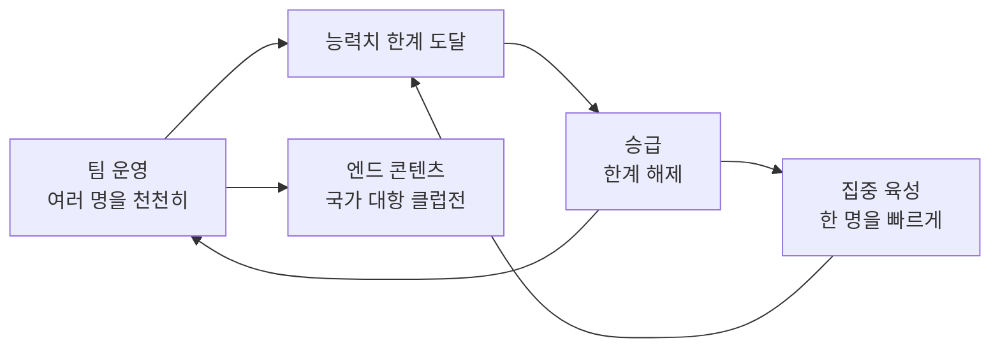

# 야구 게임 기획 문서 (큰 틀)

> 작성: KAL(기획) · Claude(정리·시뮬레이션·코드)
> 기준일: 2026-09-26
> 원칙: **최종 버전 기준으로 판단**하고, 첫 버전은 그 일부를 먼저 만든다. 세부 수치는 시뮬레이션으로 검증한다.

---

## 1. 개요

직접 조작하는 2D 모바일 야구 게임으로, 선수를 키우고 그 선수들로 팀을 운영하는 구조예요. 최대한 많은 유저를 모으는 것이 목표예요.

| 항목 | 결정 내용 |
| --- | --- |
| 플랫폼 | 안드로이드 모바일 (폰·태블릿), 가로 화면. iOS는 개발 PC에서 빌드 불가라 제외 |
| 그래픽 방식 | 완전한 2D |
| 재미의 중심 | 직접 조작 (타석과 마운드에서 직접 치고 던지기) |
| 육성 방식 | 선수 육성 + 팀 운영 혼합 (팀 운영이 최종 목표) |
| 그림 스타일 | 일본 애니메이션풍. SD·서양 카툰풍은 제외 |
| 선수 | 가상 선수 (실명 라이선스 없음) |
| 타깃 시장 | 국내와 해외 모두. 처음부터 다국어 구조로 만들고, 번역(영어 등)은 마지막 단계에 추가 |
| 개발 PC | 노트북 (i5-8250U, RAM 8GB, MX150 VRAM 2GB). 2D 개발에 제약 없음 |
| 테스트 기기 | 본인 안드로이드 폰·태블릿 (USB 연결). 에뮬레이터는 RAM 부족 |
| 엔진 | **Godot** (가볍고, 화면 구성까지 텍스트라 Claude가 코드를 쓰기 좋음) |
| 개발 방식 | 기획은 KAL, 코드는 Claude. 하루 1~2시간 |
| 멀티(유저 대결) | 첫 버전에서 제외, 추후 도입. 솔로와 겹치지 않는 별도 콘텐츠 (실시간 대전, 랭킹 챌린지, 더 쇼 대결 모드 등 참고) |
| 과금 | 추후 논의. 넣게 되면 Godot 플러그인으로 추가 (그때부터 Gradle 빌드라 빌드가 느려짐) |
| 그림 제작 | 개발 중에는 AI(힉스필드 등)로 임시 그림. 출시용 일러스트는 외주 등 방법을 마지막에 결정 |

---

## 2. 게임 구조

팀 운영이 최종 목표이고, 집중 육성과 승급은 팀을 강하게 만드는 수단이에요. 팀 운영은 여러 명을 넓고 천천히, 집중 육성은 한 명을 깊고 빠르게 키워요.

### 2.1 리그와 구단

- **한국 리그 10팀, 144경기** (상대팀별 16경기). 다른 나라 리그는 다음 버전~마지막 전.
- 내 구단은 **10개 구단 중 하나를 골라 시작** (창단 없음).
  - 구단마다 스타일(예: 거포 군단, 투수 왕국, 발야구)과 **대표 에이스(네임드 선수)**로 개성을 줌.
  - 원하면 이름·색·엠블럼을 **꾸미기** 가능.
  - 실제 구단명·로고를 연상시키는 조합은 피함 (라이선스 없음).
- 처음에는 고른 구단의 정해진 선수로 시작하고, 이후 영입으로 선수가 바뀜.
- 네임드(에이스) 선수와 일반 선수를 구분.

### 2.2 팀 구성

- **총 26명**, 타자·투수 비율은 유저 자유. 최소 타자 9명, 투수 10명.
- 투수 상한(MLB는 13명)은 타자 컨디션과 투수 피로의 밸런스를 시뮬레이션으로 보고 필요하면 설정값으로 넣음.
- **2군 없음** (유저 부담을 줄이기 위해).
- 후보 선수의 포지션 구성은 유저 자유. 부상·컨디션(다음 버전)이 교체를 만드는 이유가 됨.
- 후보가 없을 때 부상자가 나오면 **능력치가 낮은 임시 선수**가 자동으로 들어옴.
- 포지션: **주 포지션 + 서브 포지션**. 둘 다 아닌 자리에서는 수비 능력치가 크게 떨어짐.
- 벤치 선수도 팀 경기마다 성장하되 주전보다 적게 (예: 주전 5, 후보 1). 투수도 같음.
- 불펜 투수는 연속 등판 시 체력 회복이 줄어듦. 컨디션 시스템이 들어오면 함께 연동.
- 영입은 기존 선수를 **방출한 뒤** 진행. 방출은 확인 창을 띄움.

### 2.3 능력치

기준: **모든 기본 능력치는 직접 플레이에서도 뭔가를 바꿔야** 한다. 자동 플레이에서만 효과가 있으면 유저가 키우지 않는다.

| 구분 | 첫 버전 | 다음 버전 |
| --- | --- | --- |
| 타자 | 정확, 파워, 선구, 주루, 수비, 송구 | 체력 |
| 투수 | 구속, 구위, 제구, 변화, 체력 | 정신력, 수비 |

- **선구**는 선구와 인내를 합친 능력치. 직접 플레이에서는 공이 크게 보이거나 느리게 오는 효과 (미확정).
- **정확**은 맞혔을 때 안타가 될 확률 증가 (미확정).
- 역할 나누기 (자동 경기 계산):
  - 정확 = 안타, 파워 = 장타·홈런, 선구 = 볼넷
  - 구속 = 삼진형, 변화 = 장타 억제형(땅볼 유도), 구위 = 맞아도 약한 타구, 제구 = 볼넷 억제 + 실투 감소
- 투수 능력치 정의 (직접 플레이 기준, 2026-09-26 확정):

| 능력치 | 적용 범위 | 하는 일 |
| --- | --- | --- |
| 구속 | 모든 구종 | 공 속도 상승. **타이밍을 뺏어서** 삼진·헛스윙 증가 (늦은 스윙, 밀린 파울) |
| 변화 | 모든 구종 (직구 포함) | **무브먼트**: 변화 폭(각)과 예리함. **보이던 코스를 벗어나서** 삼진·헛스윙 증가, 땅볼 유도·장타 억제 |
| 구위 | 모든 구종 | 맞아도 약한 타구 → 범타 증가 |
| 제구 | 모든 구종 | 투수가 노린 곳에 공이 들어갈 확률 증가, 가운데 실투 감소 → 볼넷 억제 |

  - 구속과 변화는 둘 다 삼진을 늘리지만 방식이 다름: **구속 = 시간**(타이밍 판정), **변화 = 위치**(코스 궁합). v0에서 두 능력치가 같은 효과를 냈던 문제를 피하기 위함.
  - 구위는 무브먼트가 없어서 직접 플레이에서 결과로만 보일 수 있음. 맞는 순간 배트가 밀리는 효과, 둔탁한 소리, "구위에 밀렸다" 같은 짧은 문구로 **연출해서 보여줌** ("완벽인데 왜 범타?"라는 억울함 방지).
  - 시뮬레이터 v1은 변화를 장타 억제형으로만 계산하므로, 변화의 삼진 효과를 넣어 다시 검증해야 함.
- **구종 속도 = 직구 구속 × 구종 비율** (MLB 평균 기준). 구속이 오르면 모든 구종이 같은 비율로 빨라지고, 직구와 변화구의 km/h 차이도 커져서 타이밍을 뺏기 쉬워짐.

| 구종 | 평균 비율 | 현실 범위 (MLB 극단값) | 포심 150km/h일 때 (평균, 범위) |
| --- | --- | --- | --- |
| 직구 (포심) | 1.00 | - | 150km/h |
| 커터 | 0.95 | 0.95 ~ 0.99 | 142.5km/h (142.5 ~ 148.5) |
| 슬라이더 | 0.92 | 0.87 ~ 0.94 | 138km/h (130.5 ~ 141) |
| 스플리터 | 0.91 | ? ~ 0.98 | 136.5km/h (? ~ 147) |
| 체인지업 | 0.90 | 0.81 ~ 0.97 | 135km/h (121.5 ~ 145.5) |
| 커브 | 0.84 | 0.81 ~ 0.87 | 126km/h (121.5 ~ 130.5) |

  - 속도 순서: 직구 > 커터 > 슬라이더 > 스플리터 > 체인지업 > 커브. 조사 자료와 출처는 `docs/research/pitch-speed.md`.
  - 지금은 평균 비율로 계산. 고속 슬라이더처럼 직구와 속도가 비슷한 변화구는 **스킬**로 처리.
  - 검토 중: 투수마다 비율을 **현실 범위 안에서 랜덤**으로 정하기 (평균 근처가 자주, 극단은 드물게. 극단값은 스킬과 연결. 빠르면 반응 시간이 짧고 느리면 타이밍 차이가 커서 어느 쪽도 꽝이 아니게). 투수 구종 설계 때 결정.
  - 구속 능력치 → km/h 환산 기준은 **레벨·승급 체계가 정해진 뒤** 결정. 성장이 끝없이 이어질 수 있어서 능력치가 100을 넘는 경우까지 고려해야 함 ("50 = 리그 평균"처럼 고정하지 않음).
- **타자 체력**(다음 버전): 연속 출장 시 컨디션이 떨어지는 속도. 한 경기 안에서 지치는 방식은 쓰지 않음.
- **투수 정신력**(다음 버전): 피안타를 맞으면 정신력이 낮을수록 모든 능력치가 일시적으로 떨어짐. 하락 폭 상한과 회복(아웃, 마운드 방문)이 필요하고, 흔들림은 화면에 보여야 함.
- 클러치, 탄도, 투타 겸업, 고속 변화구(예: 고속 슬라이더)는 **스킬(특수 능력)** 후보.

### 2.4 성장

- **기본 성장**: 경기를 하면 모든 능력치가 조금씩 오름. 한 경기당 상승량은 밸런스 단계에서 결정.
- **보너스 성장**: 플레이 내용에 따라 특정 능력치가 더 오름.
  - 타자: 안타 → 정확, 홈런 → 파워, 볼넷 → 선구, 수비 플레이 → 수비·송구
  - 투수: **타이밍을 뺏어서** 잡은 삼진·헛스윙(늦음·빠름) → 구속, **공이 움직여서** 잡은 삼진·헛스윙(코스를 벗어남) → 변화, 약한 타구 범타 → 구위, 볼넷 없는 이닝 → 제구, 투구 수 → 체력
  - 투수의 삼진은 구종이 아니라 **헛스윙이 생긴 원인**으로 나눔. 삼진 하나가 한 능력치에만 가서 특정 능력치만 빨리 오르지 않고, 직구 무브먼트(변화)와도 어긋나지 않음.
  - 세부 기준(약한 타구의 정의 등)은 능력치 세부 설계에서 결정.
- **레벨**: 능력치를 올리는 수단이 아니라 **승급까지의 진행도**. 경험치가 차면 레벨업, 등급마다 최대 레벨이 있음. 최대 레벨과 능력치 한계에 도달하는 시점을 비슷하게 맞춤. 레벨업 포인트 배분은 없음.
- **승급** = 최대 레벨 + 승급 퀘스트 + 재화.
  - 승급하면 능력치 한계와 최대 레벨이 올라가고, **유저가 직접 배분하는 보너스 능력치**를 받음 (약점 보완용). 높은 등급으로 승급할수록 보너스가 커짐.
  - 승급 퀘스트는 리그와 별도인 퀘스트용 경기 (집중 육성처럼 그 선수만 플레이). 등급이 오를수록 난이도가 올라가고, 최종 승급에 가까워지면 리그 플레이 퀘스트도 검토.
  - 전체 등급 체계는 기획 단계에서 끝까지 구상하고, 첫 버전에는 2~3단계만.
- 주의할 점: 노가다 악용(예: 일부러 안 치고 볼넷 노리기), 한 능력치에 몰아넣기. 경기당 보너스 상한과 등급별 능력치 한계로 막음.

### 2.5 집중 육성 (나만의 선수 방식)

- 한 번에 **한 선수만** 집중 육성.
- 선택한 선수 한 명만 조작. 타자라면 그 선수가 타석에 설 때만 플레이하고 나머지는 자동 진행.
- 집중 육성 중에는 **그 선수의 능력치만** 빠르게 오름. 다른 팀원은 팀 경기에서만 성장.
- **육성 주기**: 짧은 주기(예: 10경기, 미확정)가 끝나면 계속 키울지 바꿀지 물어봄. 계속 키우고 싶으면 제한 없이 이어갈 수 있음.
- 게임빌 나만의 리그의 10년 졸업 방식처럼 길게 묶지 않음.
- 타자·선발·불펜은 한 경기의 플레이 양이 다름 (주기 길이 정할 때 고려).

### 2.6 게임 내 재화

- **재화 1종**. 쓰는 곳: FA 선수 영입, 랜덤 선수 영입, 승급.
- **FA 영입**: 정해진 선수가 나오고, 등급·레벨·능력치를 확인한 뒤 구매. **시즌이 끝난 뒤 새 시즌 시작 전까지만** 열림. 시즌 종료 후 FA 화면을 먼저 보여줘서 놓치지 않게 함.
- **랜덤 영입**: 재화를 내면 선수가 무작위로 나옴. 나오는 등급·레벨은 미정.
- 방향: 랜덤은 싸고 가끔 대박, FA는 비싸지만 확실. 세부 가격은 추후 논의.
- 획득: **플레이로만** — 경기 플레이(패배해도 지급, 집중 육성 포함), 시즌 최종 순위, 포스트시즌 성적. 승급 퀘스트는 재화를 쓰는 곳이라 보상에서 제외.
- 승리 > 패배, 직접 플레이 > 자동. 집중 육성은 한 경기가 짧아서 경기 단위보다 플레이량(타석·이닝) 단위 지급을 검토.
- 과금을 넣으면 랜덤 영입은 확률 공개 필요 (확률 공개는 문제 없음).

### 2.7 엔드 콘텐츠: 국가 대항 클럽전 (가칭, 다음 버전)

- 처음 이 콘텐츠에 들어올 때 국가를 선택하고, 한 번 고르면 변경 불가.
- 선택한 나라의 리그에서 **우승한 팀이 그 나라를 대표**.
- 원하면 다른 팀에서 2~3명을 차출.
- 실제로 각국 리그 우승팀이 겨루던 아시아 시리즈(2005~2013)와 비슷한 설정.
- 명칭 후보: 국가 대항 클럽전, 월드 챔피언스 시리즈. "국가대표"는 드림팀을 연상시켜서 피하는 쪽.
- 주의할 점: 리그 우승이 입장 조건이라, 난이도가 너무 높으면 엔드 콘텐츠를 못 보는 유저가 생김.

---

## 3. 경기 시스템

타석과 마운드를 직접 조작하는 것이 중심이고, 자동 플레이와 수비는 보조 수단이에요. 모든 규칙은 "직접 조작이 더 이득"이라는 원칙을 따라요.

### 3.1 조작 방식

**타격: 방향형 (커서 없음), 스와이프 입력**

- 모바일에서 커서 조작은 어렵고 못하는 유저가 못 칠 가능성이 높아서 방향형을 씀.
- 판정 방식: **타이밍 + 코스와 스윙의 궁합**. 타이밍이 기본이고, 공의 코스에 맞는 스윙을 고르면 보너스.
- **스윙 5종**: 레벨, 어퍼, 다운, 당겨치기, 밀어치기. 대각선 스윙은 넣지 않음 (스윙이 너무 많아지고, 대각선으로 그었는데 인식이 다르게 되면 불만이 생김).
- **입력: 스와이프**. 공이 오는 걸 보고 그 순간 입력해서, 코스에 반응할 수 있음.
  - 탭 = 레벨, 위 = 어퍼, 아래 = 다운, 좌·우 = **화면상 타구 방향** (우타자는 왼쪽이 당겨치기, 좌타자는 반대).
  - 타이밍은 손가락이 닿는 순간으로 판정하고, 이어지는 움직임으로 스윙 종류만 읽음 (스와이프 때문에 타이밍이 늦어지지 않게).
  - 선구 능력치의 체감 효과(공이 크게·느리게 보임)는 코스를 빨리 읽는 데 쓰임.
- **다운 스윙**: 위에서 눌러 쳐서 뜬공을 줄이고 땅볼·라인드라이브를 늘리는 스윙. 이름은 한국 팬에게 익숙한 "다운 스윙"을 씀.
- 안 치기(볼 고르기) 가능: 입력이 없으면 스윙하지 않음.
- 스윙 선택이 작전이 됨 (예: 3루 주자 → 어퍼로 희생플라이, 1루 주자 → 어퍼(뜬공)로 병살 회피, 2루 주자 → 밀어친 쪽 땅볼로 진루타, 변화구 투수 vs 어퍼스윙). 다운 스윙은 땅볼이 늘어서 병살 위험이 오히려 커짐.

**코스와 스윙 궁합** (실제 스윙 데이터 기준: 타자는 낮은 공에 올려 치고 높은 공에 평평하게 치며, 몸쪽은 앞에서 당겨치고 바깥쪽은 깊이 끌어들여 밀어침)

- 스트라이크 존을 **X자로 4구역 + 가운데 원**으로 나눔. 좌타자는 몸쪽·바깥쪽이 반대.

| 구역 | 궁합 스윙 | 반대 스윙 | 반대 스윙일 때 (현실 기준) |
| --- | --- | --- | --- |
| 위 (높은 공) | 다운 | 어퍼 | 공 밑을 맞혀 내야 뜬공, 뒤로 가는 파울, 헛스윙 |
| 아래 (낮은 공) | 어퍼 | 다운 | 공 윗부분을 맞혀 크게 튀는 땅볼 (병살 위험) |
| 몸쪽 | 당겨치기 | 밀어치기 | 먹힘: 약한 땅볼·빗맞은 뜬공이 가운데~밀어친 쪽으로, 또는 파울 |
| 바깥쪽 | 밀어치기 | 당겨치기 | 롤오버(손목이 일찍 덮임): 당겨친 쪽 약한 땅볼, 또는 헛스윙 |
| 가운데 원 | 레벨 | 없음 | 모든 스윙이 무난 |

- 궁합이 맞으면 강한 타구 확률 증가. 반대 스윙이면 약한 타구·파울·헛스윙 증가. 나머지 스윙은 보통 (보너스·패널티 없음).
- 레벨은 가운데 원에서만 보너스가 있고, 어느 구역에서도 패널티가 없는 안전한 기본값.
- 경계선 부근의 공은 양쪽 스윙 모두 **절반 보너스** (완전 궁합이 100이면 50). 딱 끊을지 경계에서 멀어질수록 부드럽게 올릴지, 보너스·패널티 크기는 시뮬레이션 후 결정.
- 어퍼·다운의 좌우 타구 방향은 공의 좌우 코스를 따름 (몸쪽 → 당겨친 쪽, 바깥쪽 → 밀어친 쪽).

**타구 결과**

- 스윙 종류는 **타구 방향**을 정하고, 방향별 결과 분포(땅볼·뜬공 비율, 홈런 비율 등)는 **현실 통계**를 따름. 예: 뜬공 중 홈런 비율은 당겨친 쪽 약 23~37%, 가운데 약 9%, 밀어친 쪽 약 4~5% (MLB).
- 스윙에 장타형·안타형 성격을 따로 주지 않음. 타구의 크기는 **타자 능력치와 상대 투수 능력치**가 함께 정함.

**타이밍 판정 (7단계)**

| 너무 빠름 | 빠름 | 좋음 | 완벽 | 좋음 | 늦음 | 너무 늦음 |
| --- | --- | --- | --- | --- | --- | --- |

- **너무 빠름**: 공이 오기 전에 휘두름(헛스윙), 또는 일찍 휘둘렀는데 운 좋게·간신히 맞힌 경우.
- **너무 늦음**: 공이 포수 미트에 들어간 뒤 휘두름(헛스윙), 또는 늦게 휘둘렀는데 운 좋게·간신히 맞힌 경우.
- "너무"는 가장 바깥 구간에만 써서, 조금 빠르거나 늦은 스윙을 "매우 빨랐다"고 느끼지 않게 함.
- 미트 도달 후 짧은 시간(예: 0.2초)까지만 늦은 헛스윙으로 치고, 그 뒤 입력은 무시함 (볼을 고른 뒤 다음 화면으로 넘어가려는 탭이 헛스윙이 되지 않게).
- **스윙마다 "완벽" 위치가 다름**: 당겨치기는 조금 일찍, 레벨이 기준, 밀어치기는 조금 늦게. 현실에서 당겨칠 때는 공을 앞에서, 밀어칠 때는 깊이 끌어들여 맞히기 때문. 그래서 빠른 공은 밀어치기, 느린 변화구는 당겨치기가 유리함. 옮기는 폭은 시뮬레이션·시험판으로 정함.

| 구간 | 결과 |
| --- | --- |
| 완벽 | 강한 타구 확률 최대. 방향은 스윙대로 |
| 좋음 (빠른 쪽) | 강한 타구가 조금 줄어듦. 방향이 당겨친 쪽으로 약간 쏠림 |
| 좋음 (늦은 쪽) | 강한 타구가 조금 줄어듦. 방향이 밀어친 쪽으로 약간 쏠림 |
| 빠름 | 약한 타구, 당겨친 쪽 파울이 늘어남 |
| 늦음 | 먹힌 타구, 밀어친 쪽 파울이 늘어남 |
| 너무 빠름 / 너무 늦음 | 대부분 헛스윙. 낮은 확률로 빗맞은 파울이나 운 좋은 빗맞은 안타 |

- 구간 폭과 능력치가 폭을 바꾸는 정도는 미정.

**상대 투수 능력치가 직접 타격에 주는 효과** (자동 경기의 역할 분리와 같은 방향)

| 능력치 | 자동 경기 역할 | 직접 타격에서의 효과 |
| --- | --- | --- |
| 구속 | 삼진형 | 공이 빨리 와서 반응할 시간이 짧음 (모든 구종이 비율대로 빨라짐) |
| 구위 | 약한 타구형 | 완벽 타이밍이어도 강한 타구 확률이 조금 줄어듦 (먹히는 공). 배트가 밀리는 연출로 보여줌 |
| 변화 | 삼진형 + 장타 억제형 | **무브먼트** (직구 포함): 변화 폭(각)이 크고 예리할수록 공이 보이던 코스에서 벗어나서 궁합 판단이 어려움. 빗맞음·헛스윙·땅볼 증가 |
| 제구 | 볼넷·실투 억제 | 가운데 실투가 줄고, **투수가 노린 곳에 공이 들어갈 확률**이 높아짐 |

**투구: 클래식 / 원 타이밍 중 유저 선택**

- 클래식: 구종·코스 선택만. 결과는 능력치가 정함.
- 원 타이밍: 원 = **제구 영역**(공이 들어갈 범위). 제구가 높을수록 원이 좁고 느리게 줄어듦.
- 탭을 안 하면: 원 안에 들어가거나 실투(폭투 또는 한가운데) 둘 중 하나. 제구가 높을수록 원 안에 들어갈 확률이 높고, 낮을수록 실투 확률이 높음 (제구의 중요성 강조, 원 타이밍 유저 한정 패널티).
- 체력이 얼마 안 남거나 정신력이 흔들릴수록 원이 **커지고 빨라짐** (크기·속도 각각 한계치 필요).
- 결과 순서 원칙: 원 타이밍 잘함 > 클래식 ≥ 원 타이밍 못함(그래도 원 안) > 탭 안 함. 어떤 탭이든 탭을 안 한 것보다는 나아야 함.
- 실투의 종류(폭투/한가운데)는 세부 설계에서 결정.

### 3.2 화면과 카메라

- 참고 화면: 컴투스프로야구2026 (컴프야V26 아님)의 타석·마운드 구도.
- 타석: 내 타자 뒤쪽에서 투수를 바라보는 구도. 타자 뒷모습이 크게 보임.
- 마운드: 내 투수 뒤쪽에서 타자를 바라보는 구도.
- 경기 화면은 뒷모습이라 모든 선수가 몸 그림 한 벌을 공유하고 유니폼 색·등번호·이름만 바꿈.
- 선수의 얼굴은 컷인과 선수 정보 화면의 일러스트로 보여줌.
- 일반 등급 선수는 실루엣으로 시작 (일러스트 작업량 감소).
- 필요한 것: 스윙·투구 동작 그림(크게 보여서 공들여야 함), 경기장 배경 2장(외야 쪽, 포수 뒤쪽).
- 화면 예시: `docs/mockups/`

### 3.3 시즌 진행

- 시즌 경기 수는 각 나라 리그에 맞춤 (한국 리그 144경기).
- 유저는 **직접 플레이할 경기 수**를 정하고, 나머지는 자동으로 진행. 직접 플레이는 연속된 경기 구간 (예: 1~20경기). 시즌 중반이나 마지막 구간을 고르는 것도 검토.
- 결정적인 순간만 직접 하는 **하이라이트 플레이**도 제공.
- 자동 경기 결과는 선수 능력치와 유저가 직접 플레이한 성적을 바탕으로 정해짐. 직접 한 경기가 적을수록 편차가 커짐.
- 직접 플레이한 경기가 적을수록 보상이 작음. 추천 기본값을 보여주고 유저가 바꿀 수 있음.
- **경기 중 자동 저장**: 앱을 끄면 그 상황부터 이어짐 (중간 이탈 악용 방지).
- **리그 AI 팀 오버롤**: 새 시즌 시작 전 한 번만, 직전 시즌 끝의 내 팀 오버롤에 맞춰 조정. 시즌 중에는 바뀌지 않음. AI 팀들은 내 오버롤 기준 ±5 범위로 퍼뜨리고, 약한 팀에도 에이스 투수·타자를 둠.
- 난이도 목표: 너무 쉽지도 어렵지도 않게. 시즌 시작 5할, 잘 키운 팀 6할 근처, 아무리 강해도 7할을 크게 넘지 않음. 계속 압도만 하면 재미가 떨어짐.
- 포스트시즌: 미정 (BASEBALL 9의 상위 4팀 방식, NPB 클라이맥스 시리즈 등 참고).

### 3.4 자동 플레이

- 유저가 귀찮을 때 경기를 중계로 보고 결과만 받음. 성적은 AI가 만듦.
- 보상은 직접 플레이보다 훨씬 작음 (예: 직접 10 : 자동 1, 비율은 밸런스 단계에서 확정).
- 타자는 한 타석이라도 직접 하면 완전 자동보다 보상을 더 줌.

### 3.5 투수 이닝과 체력

- 선발(집중 육성): 기본 3이닝. 끝나면 더 던질지, 얼마나 더 던질지 유저가 정함.
- 불펜: 1이닝 후 더 던질지 유저가 정함.
- 더 던질수록 경험치 같은 성장 보상이 커짐.
- 투구 수 한계는 체력 능력치로 정함 (예: 체력 1당 1구). 한계의 90%부터 [교체를 권합니다] 문구.
- 무리하면 패널티: 경기 결장 또는 일시적인 컨디션 하락. **능력치 영구 하락은 없음.** 결장은 시즌 경기 수 기준으로 셈.
- 원칙: 위험은 눈에 보여야 하고(피로도 표시·경고), 패널티는 일시적이어야 함.

### 3.6 수비

- 매번이 아니라 일정 확률로 수비 플레이 기회가 옴. 할지 넘어갈지 유저가 고름.
- 타격만 해도 수비·송구 능력치는 기본으로 오름. 수비 플레이를 잘하면 추가로 오름 (행운 보너스 개념).
- 빈도를 낮춰도 개발량은 줄지 않으므로 단순한 미니게임(타이밍 탭 → 송구 베이스 선택)으로 만드는 것을 검토.

---

## 4. 첫 버전(MVP) 범위

기획은 최종 버전을 기준으로 판단하고, 첫 버전은 그 일부를 먼저 만드는 것이에요. 첫 버전은 "한 경기를 직접 치고 던지는 게 재미있는가"를 확인하는 가장 작은 완성본이에요.

| 구분 | 기능 |
| --- | --- |
| 첫 버전 | 한국 리그 하나(10팀: 내 팀 + AI 9팀), 타격·투구 직접 조작, 팀 경기, 자동 플레이, 집중 육성, 기본 능력치, 투수 체력, 승급(2~3단계), 저장 |
| 다음 버전 | 엔드 콘텐츠, 수비 미니게임, 부상·컨디션, 영입, 나라별 리그, 타자 체력, 투수 정신력·수비 |
| 마지막 | 출시용 일러스트, 번역(다국어), 멀티 모드, 과금 |

- 글자를 화면과 분리하는 구조는 처음부터 만듦 (번역만 마지막).
- 경기 결과를 계산하는 부분은 화면과 분리해서 만듦 (나중에 멀티에서 서버가 같은 계산으로 검증할 수 있게).
- 개발 기간 추정(하루 1~2시간, 코드는 Claude): MVP 약 6~9개월, 전체 구상은 1년 반~2년 이상 (대략적 추정).
- 구글 플레이 개인 개발자 계정은 정식 출시 전 **테스터 12명이 14일 연속** 참여하는 비공개 테스트가 필요.

---

## 5. 시뮬레이션 결과 (v1)

능력치(1~100, 평균 50)로 타석을 3단계(볼넷·삼진 → 홈런 → 인플레이 안타)로 계산하는 파이썬 시뮬레이터 (`simulation/baseball_sim.py`).

### 5.1 리그 평균 (평균 50 팀 10개)

타율 .259, 출루율 .337, 장타율 .392, 삼진 18.6%, 볼넷 9.3%, 팀당 경기 4.3득점. 목표 리그 평균(삼진 18%, 볼넷 9% 등)은 대략치이고, 실제 KBO 리그 평균으로 맞추는 것이 다음 단계.

### 5.2 능력치 역할 (50 → 70, 영향력 배율 1.0 기준)

| 능력치 | 결과 |
| --- | --- |
| 정확 | 타율 .261 → .323, 삼진 18% → 11% |
| 파워 | 홈런 2배, 장타율 .391 → .521 |
| 선구 | 볼넷 9% → 15%, 출루율 .336 → .380 |
| 주루 | 타율 .277 |
| 구속 | 삼진 26.6% (삼진형), 피OPS .643 |
| 구위 | 피안타율 .230 (약한 타구형), 피OPS .645 |
| 변화 | 홈런 1.36% (장타 억제형), 피OPS .642 |
| 제구 | 볼넷 5.1% (볼넷 억제형), 피OPS .682 |

v0에서는 구속과 변화가 같은 효과(삼진 증가)를 냈고 구위가 혼자 강했는데, v1에서 역할을 나눠 구속·구위·변화가 비슷해짐.

### 5.3 난이도 조정 (영향력 배율)

AI 9팀은 50±5, 각 조건 10시즌 평균.

| 영향력 배율 | 내 팀 +0 | +5 | +10 | +15 | 1위-꼴찌 차 |
| --- | --- | --- | --- | --- | --- |
| 1.0 | .488 | .741 | .879 | .955 | .531 |
| 0.7 | .519 | .670 | .749 | .897 | .369 |
| 0.5 | .499 | .654 | .710 | .830 | .322 |
| 0.4 | .509 | .599 | .676 | .774 | .250 |
| **0.35 (선택)** | **.501** | **.563** | **.654** | **.722** | **.234** |
| 0.3 | .509 | .587 | .649 | .747 | .202 |

- 0.35가 목표에 가장 가까움. 리그 차이(.234)도 2024 KBO(1위 .613, 꼴찌 .403, 차이 .210)와 비슷.
- 대신 능력치 하나의 체감은 약해짐 (정확 50→70: 타율 .261 → .284). 직접 플레이의 체감(공이 느려 보이는 효과 등)은 능력치 세부 설계에서 따로 정함.
- 다음 시뮬레이션 후보: 한 시즌 동안의 성장량 (시즌 동안 주전 오버롤이 5~10 정도 오르도록).

---

## 6. 보류 목록 (세부 설계에서 결정)

**경기·조작**

- [ ] 원 타이밍 세부 수치 (제구별 원 크기·속도, 탭 안 했을 때 원 안 확률). 직접 플레이의 볼넷·실투 비율을 자동 계산과 맞추기
- [ ] 타이밍 7단계의 구간 폭, 능력치가 폭을 바꾸는 정도
- [ ] 스윙별 "완벽" 위치를 옮기는 폭
- [ ] 투수 능력치가 직접 타격에 주는 효과의 크기
- [ ] 시뮬레이터에 변화의 삼진 효과 반영 후 투수 능력치 균형 재검증
- [ ] 구속 능력치 → km/h 환산 기준 (레벨·승급 체계 확정 후, 100 초과 능력치 포함)
- [ ] 능력치 범위: 시뮬레이터는 1~100(평균 50)을 가정하지만 성장이 끝없이 이어지면 100을 넘을 수 있음. 등급 체계와 함께 다시 정함
- [ ] 투수 구종 설계: 슬로우 커브 같은 느린 구종, 아직 안 다룬 구종(싱커, 투심, 서클체인지업, 포크볼, 스위퍼 등), 구종 비율 랜덤 여부와 분포 (`docs/research/pitch-speed.md` 참고)
- [ ] 코스 궁합 보너스·패널티 크기, 경계선 처리 (시뮬레이션), 가운데 원(레벨 구역) 크기
- [ ] 카메라 구도 추가 (여러 구도 제공)
- [ ] 수비 미니게임 세부 설계, 포지션별 수비 기회 (타구 방향에 따라)
- [ ] 자동 플레이 보상 비율
- [ ] 포스트시즌 방식

**육성·성장**

- [ ] 육성 주기 길이 (타자·선발·불펜의 플레이 양 차이 고려)
- [ ] 한 경기당 성장량 (시뮬레이션으로)
- [ ] 부상·컨디션 패널티 강도와 타자 적용
- [ ] 승급 시 스킬 획득 여부, 스킬(특수 능력) 시스템
- [ ] 등급 체계
- [ ] 오버롤 계산 기준 (보유 선수 전체 vs 선발 라인업, 승리 기여도 비중)
- [ ] 리그 단계 이름 또는 난이도별 리그

**영입·재화**

- [ ] 랜덤 영입의 등급·레벨, FA와 랜덤의 가격 차이
- [ ] 집중 육성의 재화 지급 단위

**구단**

- [ ] 10개 구단의 이름, 스타일, 대표 에이스

**엔드 콘텐츠**

- [ ] 국가 선택 시점, 차출 선수 운영, 명칭, 입장 조건 난이도

**그림·연출**

- [ ] 일러스트 전반 (여성 캐릭터 등장 여부 포함), 출시용 그림 제작 방법 (외주 등). AI 그림은 게이머 반감(부정 85%), 동작 그림 일관성, 저작권 등록 불가 문제가 있음
- [ ] 일반 등급은 실루엣, 승급 시 일러스트 선택 방식
- [ ] 네임드 선수 고유 일러스트, 에이스 컷인 연출
- [ ] 유저 이미지 업로드 (저작권·검수 부담. 나만 보는 방식이면 부담이 작음)

**기술·현지화**

- [ ] 다국어 구조: 글자 분리, 글자 길이, 폰트 용량
- [ ] 야구 용어·기록 표기의 나라별 차이
- [ ] 일본어 지원 시점, 스토어 페이지 현지화
- [ ] 해외 리그 팀 수·경기 수 (일본 12팀은 그대로 가능, 미국 30팀·162경기는 축소 조정 필요할 수 있음)
- [ ] 과금 (결제 검증, 구매 복원, 상점·확률 공개 화면, 과금·무과금 밸런스)

---

## 7. 참고 자료

이용자 수가 목표라면 기준은 컴프야가 아니라 BASEBALL 9. 비라이선스 팀 육성 게임으로 5,000만 다운로드를 넘겼고, 1인 육성 야구 게임은 성적이 약한 편. (2026-09-24 조회)

| 게임 | 방식 | 평점 (평가 수) | 다운로드 |
| --- | --- | --- | --- |
| [BASEBALL 9](https://play.google.com/store/apps/details?id=us.kr.baseballnine&hl=en_US) | 팀 육성, 비라이선스 | 4.6 (47만) | 5,000만+ |
| [컴투스프로야구V26](https://play.google.com/store/apps/details?id=com.com2us.futurecpb.android.google.global.normal&hl=en_US) | 팀 육성, 실명 | 4.5 (5.4만) | 100만+ |
| [컴투스프로야구2026](https://apps.apple.com/kr/app/id880551258) (iOS) | 팀 육성, 실명 | 4.3 (3만) | - |
| [게임빌프로야구 슈퍼스타즈](https://apps.apple.com/kr/app/id1396381549) (iOS) | 1인 육성 + 구단 | 4.1 (7천) | - |
| [Baseball Superstar: MVP Career](https://play.google.com/store/apps/details?id=com.basebll.rising.star&hl=en_US) | 1인 육성, 인디 | 4.6 (1.7천) | 5만+ |

**시리즈 역사에서 얻은 교훈**

- 게임빌 프로야구: 2006년 나만의 리그 도입 후 인기가 크게 올랐고 누적 7천만 다운로드 가까이 기록. 2013년판은 나만의 리그만 남기고 나머지를 없앤 개편으로 실패, 2014년 11월 서비스 종료.
- 슈퍼스타즈 리뷰: "6주 키우고 또 같은 과정을 반복"하는 구조와 자동 진행이 많아 야구하는 느낌이 없다는 불만이 많음.
- 파워프로 앱: 1인 육성(석세스) 중심으로 2014년 출시 후 2018년 3,500만 다운로드. 키운 선수들이 모여 팀이 되는 구조.
- 컴투스프로야구 리그 모드: 시즌 길이 144/72/36경기와 포스트시즌만 선택 가능, 경기마다 공격만/수비만/전체/자동 선택, 자동은 보상이 줄어듦.
- MLB 9이닝스 라이벌 26: 결정적인 순간만 직접 하는 하이라이트 플레이, 난이도가 오를수록 시즌 경기 수 증가.
- Baseball Superstars 2013(게임빌 해외판): 타자는 한 경기 세 타석, 투수는 2경기에 한 번 2~3이닝.

**출처**

- [게임빌 프로야구 시리즈 – 나무위키](https://namu.wiki/w/%EA%B2%8C%EC%9E%84%EB%B9%8C%20%ED%94%84%EB%A1%9C%EC%95%BC%EA%B5%AC%20%EC%8B%9C%EB%A6%AC%EC%A6%88)
- [피처폰 시절 인생게임! 게임빌 프로야구 – 다음](https://v.daum.net/v/APXTMc5cms)
- [게임빌프로야구 슈퍼스타즈/평가 – 나무위키](https://namu.wiki/w/%EA%B2%8C%EC%9E%84%EB%B9%8C%ED%94%84%EB%A1%9C%EC%95%BC%EA%B5%AC%20%EC%8A%88%ED%8D%BC%EC%8A%A4%ED%83%80%EC%A6%88/%ED%8F%89%EA%B0%80)
- [컴투스, 야구게임으로 1조 벌었다 – 뉴스핌](https://www.newspim.com/news/view/20260121000513)
- [파워프로 앱의 역사 – 게임위드](https://xn--odkm0eg.gamewith.jp/article/show/107792)
- [컴투스프로야구/리그 – 나무위키](https://namu.wiki/w/%EC%BB%B4%ED%88%AC%EC%8A%A4%ED%94%84%EB%A1%9C%EC%95%BC%EA%B5%AC/%EB%A6%AC%EA%B7%B8)
- [MLB 9INNINGS RIVALS 26 League Mode](https://community.withhive.com/MLB9IRIVALS/en/board/23/210)
- [Baseball Superstars 2013 Review – Pocket Gamer](https://www.pocketgamer.com/baseball-superstars-2013/review/)
- [BASEBALL 9 – AppBrain](https://www.appbrain.com/app/baseball-9/us.kr.baseballnine)
- [Baseball 9 공략 사이트 (baseball9.io)](https://baseball9.io/)
- [아시아 시리즈 – 위키백과](https://ko.wikipedia.org/wiki/%EC%95%84%EC%8B%9C%EC%95%84_%EC%8B%9C%EB%A6%AC%EC%A6%88)
- [2024 KBO League season – Wikipedia](https://en.wikipedia.org/wiki/2024_KBO_League_season)
- [26-man roster – MLB Glossary](https://www.mlb.com/glossary/transactions/26-man-roster)
- [Statcast – MLB Glossary](https://www.mlb.com/glossary/statcast)
- [New Statcast metrics measure swing path, attack angle, attack direction – MLB.com](https://www.mlb.com/news/new-statcast-swing-metrics-2025) · [Attack Angle](https://www.mlb.com/glossary/statcast/attack-angle) · [Swing Path (Tilt)](https://www.mlb.com/glossary/statcast/swing-path-tilt) – MLB Glossary
- [Batted Ball Direction – FanGraphs](https://library.fangraphs.com/offense/batted-ball-direction/) · [Hitting It Where It's Pitched – FanGraphs Community](https://community.fangraphs.com/hitting-it-where-its-pitched/) · [The Physics of the Pop-Up – The Hardball Times](https://tht.fangraphs.com/the-physics-of-the-pop-up/)
- [The Direction of Home Runs – Lookout Landing](https://www.lookoutlanding.com/2012/11/9/3620530/the-direction-of-home-runs)
- [낮은 게 투수의 미덕? '하이 패스트볼' 전성시대 – 서울신문](https://www.seoul.co.kr/news/sport/baseball/2022/01/13/20220113026007)
- [Rollover in Baseball – Dugout Edge](https://www.dugoutedge.com/baseball-terms-dictionary/rollover)
- [DIPS](https://library.fangraphs.com/principles/dips/) · [BABIP](https://library.fangraphs.com/pitching/babip/) · [Plate Discipline](https://library.fangraphs.com/offense/plate-discipline/) · [Clutch](https://library.fangraphs.com/misc/clutch/) – FanGraphs
- [The Meatball: Analyzing Middle-Middle Pitches – Sports Info Solutions](https://www.sportsinfosolutions.com/2022/08/24/the-meatball-analyzing-middle-middle-pitches/)
- [MLB The Show 26 Batting Guide](https://clutchpoints.com/gaming/mlb-the-show-26-batting-guide) · [Pitching Guide](https://clutchpoints.com/gaming/mlb-the-show-26-pitching-guide-best-interfaces-pitch-types) – ClutchPoints
- [Gamers Are Overwhelmingly Negative About Gen AI in Video Games – Quantic Foundry](https://quanticfoundry.com/2025/12/18/gen-ai/)
- [App testing requirements for new personal developer accounts – Play Console Help](https://support.google.com/googleplay/android-developer/answer/14151465?hl=en)
- [Godot Google Play Billing – Godot Asset Store](https://store.godotengine.org/asset/godot-foundation/godot-google-play-billing/)
