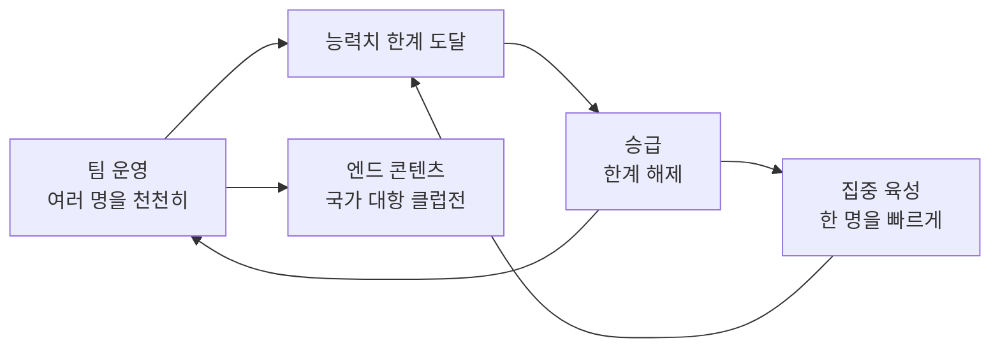

# 야구 게임 기획 문서 (큰 틀)

> 작성: KAL(기획) · Claude(정리·시뮬레이션·코드)
> 기준일: 2026-09-26
> 원칙: **최종 버전 기준으로 판단**하고, 첫 버전은 그 일부를 먼저 만든다. 세부 수치는 시뮬레이션으로 검증한다.

---

## 1. 개요

직접 조작하는 2D 모바일 야구 게임으로, 선수를 키우고 그 선수들로 팀을 운영하는 구조예요. 최대한 많은 유저를 모으는 것이 목표예요.

| 항목 | 결정 내용 |
| --- | --- |
| 플랫폼 | 안드로이드 모바일 (폰·태블릿), 가로 화면. iOS는 개발 PC에서 빌드 불가라 제외 |
| 그래픽 방식 | 완전한 2D |
| 재미의 중심 | 직접 조작 (타석과 마운드에서 직접 치고 던지기) |
| 육성 방식 | 선수 육성 + 팀 운영 혼합 (팀 운영이 최종 목표) |
| 그림 스타일 | 일본 애니메이션풍. SD·서양 카툰풍은 제외 |
| 선수 | 가상 선수 (실명 라이선스 없음) |
| 타깃 시장 | 국내와 해외 모두. 처음부터 다국어 구조로 만들고, 번역(영어 등)은 마지막 단계에 추가 |
| 개발 PC | 노트북 (i5-8250U, RAM 8GB, MX150 VRAM 2GB). 2D 개발에 제약 없음 |
| 테스트 기기 | 본인 안드로이드 폰·태블릿 (USB 연결). 에뮬레이터는 RAM 부족 |
| 엔진 | **Godot** (가볍고, 화면 구성까지 텍스트라 Claude가 코드를 쓰기 좋음) |
| 개발 방식 | 기획은 KAL, 코드는 Claude. 하루 1~2시간 |
| 멀티(유저 대결) | 첫 버전에서 제외, 추후 도입. 솔로와 겹치지 않는 별도 콘텐츠 (실시간 대전, 랭킹 챌린지, 더 쇼 대결 모드 등 참고) |
| 과금 | 추후 논의. 넣게 되면 Godot 플러그인으로 추가 (그때부터 Gradle 빌드라 빌드가 느려짐) |
| 그림 제작 | 개발 중에는 AI(힉스필드 등)로 임시 그림. 출시용 일러스트는 외주 등 방법을 마지막에 결정 |

---

## 2. 게임 구조

팀 운영이 최종 목표이고, 집중 육성과 승급은 팀을 강하게 만드는 수단이에요. 팀 운영은 여러 명을 넓고 천천히, 집중 육성은 한 명을 깊고 빠르게 키워요.

### 2.1 리그와 구단

- **한국 리그 10팀, 144경기** (상대팀별 16경기). 다른 나라 리그는 다음 버전~마지막 전.
- 내 구단은 **10개 구단 중 하나를 골라 시작** (창단 없음).
  - 구단마다 스타일(예: 거포 군단, 투수 왕국, 발야구)과 **대표 에이스(네임드 선수)**로 개성을 줌.
  - 원하면 이름·색·엠블럼을 **꾸미기** 가능.
  - 실제 구단명·로고를 연상시키는 조합은 피함 (라이선스 없음).
- 처음에는 고른 구단의 정해진 선수로 시작하고, 이후 영입으로 선수가 바뀜.
- 네임드(에이스) 선수와 일반 선수를 구분.

### 2.2 팀 구성

- **총 26명**, 타자·투수 비율은 유저 자유. 최소 타자 9명, 투수 10명.
- 투수 상한(MLB는 13명)은 타자 컨디션과 투수 피로의 밸런스를 시뮬레이션으로 보고 필요하면 설정값으로 넣음.
- **2군 없음** (유저 부담을 줄이기 위해).
- 후보 선수의 포지션 구성은 유저 자유. 부상·컨디션(다음 버전)이 교체를 만드는 이유가 됨.
- 후보가 없을 때 부상자가 나오면 **능력치가 낮은 임시 선수**가 자동으로 들어옴.
- 포지션: **주 포지션 + 서브 포지션**. 둘 다 아닌 자리에서는 수비 능력치가 크게 떨어짐.
- 벤치 선수도 팀 경기마다 성장하되 주전보다 적게 (예: 주전 5, 후보 1). 투수도 같음.
- 불펜 투수는 연속 등판 시 체력 회복이 줄어듦. 컨디션 시스템이 들어오면 함께 연동.
- 영입은 기존 선수를 **방출한 뒤** 진행. 방출은 확인 창을 띄움.

### 2.3 능력치

기준: **모든 기본 능력치는 직접 플레이에서도 뭔가를 바꿔야** 한다. 자동 플레이에서만 효과가 있으면 유저가 키우지 않는다.

| 구분 | 첫 버전 | 다음 버전 |
| --- | --- | --- |
| 타자 | 정확, 파워, 선구, 주루, 수비, 송구 | 체력 |
| 투수 | 구속, 구위, 제구, 변화, 체력 | 정신력, 수비 |

- **선구**는 선구와 인내를 합친 능력치. 직접 플레이에서는 **상대 투수 구속과 비교해 공이 느려지거나 빨라지는 효과** (2026-09-27 확정, 3.1절 "타자 능력치가 직접 타격에 주는 효과").
- **정확**은 직접 플레이에서 **입력 후 실수를 줄여 주는 능력**. 상대 투수 변화와 비교해 헛스윙·약한 타구를 줄임 (2026-09-27 확정, 3.1절 "타자 능력치가 직접 타격에 주는 효과").
- **파워**는 직접 플레이에서 **타구 속도(비거리)**. 상대 투수 구위와 비교하고, 타이밍이 좋을수록 효과가 큼 (2026-09-27 확정, 같은 절).
- 역할 나누기 (자동 경기 계산):
  - 정확 = 안타, 파워 = 장타·홈런, 선구 = 볼넷
  - 구속 = 삼진형, 변화 = 장타 억제형(땅볼 유도), 구위 = 맞아도 약한 타구, 제구 = 볼넷 억제 + 실투 감소
- 투수 능력치 정의 (직접 플레이 기준, 2026-09-26 확정):

| 능력치 | 적용 범위 | 하는 일 |
| --- | --- | --- |
| 구속 | 모든 구종 | 공 속도 상승. **타이밍을 뺏어서** 삼진·헛스윙 증가 (늦은 스윙, 밀린 파울) |
| 변화 | 모든 구종 (패스트볼 포함) | **무브먼트**: 변화 폭(각)과 예리함. **보이던 코스를 벗어나서** 삼진·헛스윙 증가, 땅볼 유도·장타 억제 |
| 구위 | 모든 구종 | 맞아도 약한 타구 → 범타 증가 |
| 제구 | 모든 구종 | 투수가 노린 곳에 공이 들어갈 확률 증가, 가운데 실투 감소 → 볼넷 억제 |

  - 구속과 변화는 둘 다 삼진을 늘리지만 방식이 다름: **구속 = 시간**(타이밍 판정), **변화 = 위치**(코스 궁합). v0에서 두 능력치가 같은 효과를 냈던 문제를 피하기 위함.
  - 구위의 직접 플레이 효과는 **(파워 − 구위) 비교 자체**로 정함 (2026-09-27). 구위만의 별도 감소 효과를 따로 두면 두 번 계산되기 때문.
  - 구위는 무브먼트가 없어서 직접 플레이에서 결과로만 보일 수 있음. 맞는 순간 배트가 밀리는 효과와 둔탁한 소리로 **연출해서 보여줌** ("완벽인데 왜 범타?"라는 억울함 방지). 글자 문구는 넣지 않음 (2026-10-05, 투구 뒤 정보를 줄이기 위해).
  - 시뮬레이터 v1은 변화를 장타 억제형으로만 계산하므로, 변화의 삼진 효과를 넣어 다시 검증해야 함.
- **구종 속도 = 포심 구속 × 구종 비율** (한 투수 안 비율의 2025 MLB 평균). 구속이 오르면 모든 구종이 같은 비율로 빨라지고, 패스트볼과 변화구의 km/h 차이도 커져서 타이밍을 뺏기 쉬워짐.

| 구종 | 평균 비율 | 투수마다 범위 | 포심 150km/h일 때 (평균) |
| --- | --- | --- | --- |
| 포심 | 1.00 | - | 150km/h |
| 싱커 | 1.00 | 0.99 ~ 1.01 | 150km/h |
| 커터 | 0.95 | 0.92 ~ 0.98 | 142.5km/h |
| 체인지업 | 0.92 | 0.89 ~ 0.95 | 138km/h |
| 슬라이더 | 0.91 | 0.88 ~ 0.94 | 136.5km/h |
| 스플리터 | 0.91 | 0.88 ~ 0.94 | 136.5km/h |
| 스위퍼 | 0.88 | 0.85 ~ 0.91 | 132km/h |
| 너클커브 | 0.87 | 0.84 ~ 0.90 | 130.5km/h |
| 커브 | 0.85 | 0.82 ~ 0.88 | 127.5km/h |

  - **평균 비율은 한 투수 안 비율** (2026-10-07 확정): 투수마다 "그 구종 평균 구속 ÷ 같은 투수의 포심 평균 구속"을 구해 평균 낸 값 (2025 MLB, Baseball Savant 직접 계산, `docs/research/pitch-speed.md` 6장). 게임 공식이 "그 투수의 포심 × 비율"이라 이 기준이 맞음. 이전에는 리그 평균 구속끼리 나눈 값(RotoWire 2025)을 썼는데, 구종마다 던지는 투수 집단이 달라 틀어짐 (예: 싱커 투수는 포심이 느린 편이라 리그 평균으로는 싱커가 0.98로 나오지만 한 투수 안에서는 0.996). 바뀐 값: 싱커 0.98 → 1.00, 체인지업 0.91 → 0.92, 슬라이더 0.90 → 0.91, 스플리터 0.92 → 0.91, 스위퍼 0.87 → 0.88, 너클커브 0.86 → 0.87, 커브 0.86 → 0.85.
  - 속도 순서: 포심·싱커 > 커터 > 체인지업 > 슬라이더·스플리터 > 스위퍼 > 너클커브 > 커브. 다른 구종의 비율은 아래 "투수 구종" 표.
  - **투수마다 비율을 랜덤으로 정함** (2026-10-07 확정, KAL: 그게 더 재미있음). **대부분 평균에 가깝게**, 극단은 드물게 (종 모양). 빠르면 반응 시간이 짧고 느리면 타이밍 차이가 커서 어느 쪽도 꽝이 아니게.
  - **범위는 평균 ±0.03** (2026-10-07 확정. 포심 150km/h면 약 ±4.5km/h, KAL: 3~5km/h 차이는 큰 차이가 아님). **싱커만 ±0.01** (현실 싱커는 대부분 포심과 거의 같은 속도라 넓히면 포심보다 빠른 싱커가 자주 나옴). 현실 하위·상위 5%(슬라이더 약 ±0.035, 커브 약 ±0.045)보다 조금 좁음: 대부분 평균 근처로 하려고 일부러 좁힘. km/h가 아니라 비율로 정해서 포심이 느린 투수에게도 같은 느낌의 차이. 근거: 현실도 한 투수 안의 비율이 평균 근처에 몰린 종 모양.
  - **속도가 겹치는 구종은 변화로 구분** (2026-10-07, KAL): 현실과 크게 다르지 않으면 범위가 겹쳐도 됨 (예: 현실 슬라이더와 스위퍼는 구속 차이가 크지 않고 옆으로 더 휘느냐의 차이). 겹치지 않게 하는 것은 **속도가 주된 차이인 특수 구종**뿐 (아래 "투수 구종").
  - 성장으로 비율을 바꿀 수 있는지는 정하지 않음. **성장 개념을 따로 다룰 때** 함께 정함 (KAL, 2026-10-07).
  - 구속 능력치 → km/h 환산 기준은 **레벨·승급 체계가 정해진 뒤** 결정. 성장이 끝없이 이어질 수 있어서 능력치가 100을 넘는 경우까지 고려해야 함 ("50 = 리그 평균"처럼 고정하지 않음).
- **투수 구종** (2026-10-05 확정, 조사 자료 `docs/research/pitch-types.md`)
  - 원칙: **타자가 다르게 느끼는 공만 다른 구종**. 아래 다섯 값 중 하나라도 확실히 다르면 따로 둠. 최대한 다양한 구종을 넣는 방향 (KAL).
  - **구종을 정의하는 다섯 값**: ① 속도 비율(포심 대비) ② 움직임 방향 ③ 움직임 크기(기준값, 실제 크기 = 이 값 × 변화 능력치) ④ 꺾이는 시점(일찍 부드럽게 ~ 늦게 뚝) ⑤ 회전 모양(화면 그림). 변화 능력치는 그대로 "얼마나", 이 값들은 구종마다 "어떻게".
  - **분류는 MLB식 세 계열** (KAL. 속도로 빠른·느린 변화구를 나누는 안은 경계가 애매해서 쓰지 않음):

    | 계열 | 기본 구종 (11) | 특수 구종 (12) |
    | --- | --- | --- |
    | 패스트볼 계열 (Fastballs) | 포심, 싱커, 커터 | - |
    | 브레이킹볼 (Breaking Balls) | 슬라이더, 스위퍼, 커브, 너클커브 | 고속 슬라이더(슬러터), 종슬라이더, 슬러브, 12-6 커브, 파워커브, 슬로우 커브, 이퓨스 |
    | 오프스피드·떨어지는 공 (Off-Speed & Splitters) | 체인지업, 서클체인지업, 스플리터, 포크볼 | 스플링커, 킥 체인지업, 벌칸 체인지업, 팜볼, 스크류볼 |

    - 싱커 = 투심 (KAL: 같은 구종으로 묶고 표기는 "싱커". MLB도 같은 구종 SI로 셈).
    - 이퓨스는 브레이킹볼 (KAL: Statcast의 독립 구종이자 느린 브레이킹볼). 커터는 패스트볼 그립이라 패스트볼 계열, 스플링커는 스플리터 그립이라 오프스피드, 스크류볼은 서클체인지업과 같은 쪽으로 휘어 오프스피드 (MLB가 어디로 묶는지는 확인 못 함).
    - 쓰임 후보: 타석 화면 구석의 상대 구종 목록을 계열로 묶어 보여주기, 스킬 대상(예: "브레이킹볼 변화 +").
  - **구종별 값 (초안)**: 방향은 투수 기준(팔 쪽 = 던지는 팔 쪽, 글러브 쪽 = 반대), 왼손 투수는 좌우가 뒤집힘. 크기 1~5는 기준값. ★ = 자료가 없어 비슷한 구종과 비교해 추정한 값 (시뮬레이션·시험판에서 조정).

    | 계열 | 구종 | 속도 비율 | 방향 | 크기 | 꺾이는 시점 | 회전 모양 |
    | --- | --- | --- | --- | --- | --- | --- |
    | 패스트볼 | 포심 | 1.00 | 위 (덜 떨어짐) | 1 | 곧게 | 역회전 세로 줄무늬 |
    | 패스트볼 | 싱커 | 1.00 | 팔 쪽 아래 | 3 | 보통 | 비스듬한 줄무늬 |
    | 패스트볼 | 커터 | 0.95 | 글러브 쪽 | 1 | 늦게 | 살짝 기운 줄무늬 |
    | 브레이킹 | 슬라이더 | 0.91 | 글러브 쪽 (조금 아래) | 3 | 늦게 | 빨간 점 |
    | 브레이킹 | 스위퍼 | 0.88 | 글러브 쪽 (거의 안 떨어짐) | 5 | 일찍 크게 | 옆으로 도는 줄무늬 |
    | 브레이킹 | 커브 | 0.85 | 글러브 쪽 아래 | 4 | 일찍 (포물선) | 앞으로 도는 회전 |
    | 브레이킹 | 너클커브 | 0.87 | 글러브 쪽 아래 | 4 | 늦게 날카롭게 | 앞 회전, 더 빠르게 |
    | 브레이킹 | 고속 슬라이더 (특수) | 0.94 이상 | 글러브 쪽 | 2 | 늦게 | 빨간 점, 빠르게 |
    | 브레이킹 | 종슬라이더 (특수) | 0.91★ | 아래 (글러브 쪽 조금) | 3 | 늦게 | 빨간 점 |
    | 브레이킹 | 슬러브 (특수) | 0.87 | 글러브 쪽 대각선 아래 | 4 | 일찍 | 기울어진 앞 회전 |
    | 브레이킹 | 12-6 커브 (특수) | 0.85★ | 똑바로 아래 | 4 | 일찍 (포물선) | 정면 앞 회전 |
    | 브레이킹 | 파워커브 (특수) | 0.90★ (0.88부터) | 아래 (곧게) | 3 | 늦게 날카롭게 | 앞 회전, 빠르게 |
    | 브레이킹 | 슬로우 커브 (특수) | 0.78★ | 글러브 쪽 아래 | 5 | 아주 일찍 (큰 포물선) | 앞 회전, 느리게 |
    | 브레이킹 | 이퓨스 (특수) | 0.60★ | 높은 포물선으로 아래 | 5 | 아주 일찍 | 느린 회전 |
    | 오프스피드 | 체인지업 | 0.92 | 아래 (팔 쪽 조금) | 2 | 보통 | 패스트볼처럼 보이는 느린 회전 |
    | 오프스피드 | 서클체인지업 | 0.90★ | 팔 쪽 아래 | 3 | 보통 | 옆으로 기운 느린 회전 |
    | 오프스피드 | 스플리터 | 0.91 | 아래 | 3 | 늦게 뚝 | 느린 회전 (약 20바퀴) |
    | 오프스피드 | 포크볼 | 0.89★ | 아래 | 4 | 늦게 뚝 (폭포처럼) | 거의 무회전 (약 10바퀴) |
    | 오프스피드 | 스플링커 (특수) | 0.97 | 팔 쪽 아래 | 4 | 늦게 | 회전 적음 |
    | 오프스피드 | 킥 체인지업 (특수) | 0.93★ | 아래 (팔 쪽 조금) | 3 | 늦게 뚝 | 회전 적음 |
    | 오프스피드 | 벌칸 체인지업 (특수) | 0.90★ | 아래 | 3 | 늦게 | 회전 적음, 비스듬 |
    | 오프스피드 | 팜볼 (특수) | 0.80★ | 아래 (옆 거의 없음) | 4 | 부드럽게 가라앉음 | 거의 무회전 + 흔들림 그림 |
    | 오프스피드 | 스크류볼 (특수) | 0.80★ | 팔 쪽 아래 | 4 | 일찍 | 커브 반대 방향 앞 회전 |

    - 근거: 비율은 한 투수 안 비율의 2025 MLB 평균(위 표). 슬러브 0.87 = Savant 2025 슬러브 투수 9명 평균 0.873 (표본 적음). 스플링커 0.97 = 듀란 96~97mph ÷ 포심 약 101mph. 고속 슬라이더 0.94 이상 = 현실 가장 빠른 쪽(디그롬 0.94). 포크볼 0.89 = 스플리터 0.91보다 0.02 느림 (2026-10-07 확정. NPB 평균 포크 약 135km/h가 스플리터 약 138km/h보다 약 3km/h 느린 것에 맞춤, 연도 확인 못 함. Savant 2025 센가 0.871·사사키 0.883, 2024 잭 톰프슨 0.924(72구)는 표본이 적어 참고만). 이전 값 0.91(NPB 포크 135 ÷ 포심 148)은 스플리터를 0.91로 바꾸면서 같아져 "조금 느림"과 어긋남. 스크류볼은 옛 평균 69.2mph로 서클체인지업(85.1mph)보다 훨씬 느림 (KAL: 서클체인지업보다 느리게).
    - 무브먼트 자료 (IVB 기준): 포심 위 +15~20인치(2024 평균 +16)·팔 쪽 3~8, 싱커 위 +8~14·팔 쪽 12~18, 커터 위 +10~15·글러브 쪽 2~8, 슬라이더 위아래 거의 0·글러브 쪽 5~15(스위퍼는 그 이상), 커브 아래 약 -10(2024 평균), 체인지업 위 +6~12·팔 쪽 ([Baseball Scouter](https://baseballscouter.com/vertical-vs-horizontal-pitch-break/), [Optimum Athletes](https://www.optimumathletes.com/blog/pitch-metrics-horizontal-and-vertical-break)). 게임 속 공은 현실 속도가 아니라서 인치를 그대로 쓰지 않고 방향·단계로 바꿈.
    - 회전: MLB 스플리터 평균 1,302rpm, 사사키 519rpm ([MLB Korea](https://www.mlbkor.com/news/articleView.html?idxno=20644)). 홈까지 스플리터 약 20바퀴, 포크볼 약 10바퀴 ([halftime-media](https://halftime-media.com/sports-market/baseball-split/)). **포크볼·팜볼은 무회전이 아니라 무회전에 가까운 공** (KAL).
  - **회전 그림은 계열 그림 5개 + 변형**: 줄무늬(패스트볼 계열, 기울기로 구분) / 빨간 점(슬라이더류, 빠르기로) / 앞으로 도는 회전(커브류·이퓨스, 스크류볼은 반대 방향, 축·빠르기로) / 느린 회전·거의 무회전(오프스피드, 빠르기·흔들림으로) / 옆으로 도는 줄무늬(스위퍼).
  - **비슷한 구종끼리 다른 점**:

    | 구종 | 비교 | 다른 점 |
    | --- | --- | --- |
    | 커터 | 포심 | 살짝 휨 (②③) |
    | 고속 슬라이더 | 슬라이더 | 포심과 속도 차이가 아주 작음 (①). "고속"은 km/h가 아니라 **포심 대비 비율** (절대 속도는 구속 능력치가 맡음) |
    | 종슬라이더 | 슬라이더 | 아래로 떨어짐 (②). 스플리터와는 회전 모양으로 구분 (⑤) |
    | 슬러브 | 슬라이더·커브 | 그 사이로 비스듬히 (②) |
    | 너클커브 | 커브 | 회전이 많아 늦게 날카롭게 꺾임 (④⑤) |
    | 12-6 커브 | 커브 | 똑바로 아래로 (②) |
    | 파워커브 | 커브 | 슬라이더만큼 빠르고 곧게 떨어짐 (①②) |
    | 슬로우 커브 | 커브 | 아주 느림 (①) |
    | 이퓨스 | 슬로우 커브 | 엄청 느리고 높게 날아옴 (①) |
    | 서클체인지업 | 체인지업 | 팔 쪽으로 휨 (②, KAL) |
    | 킥 체인지업 | 체인지업 | 더 빠르고 회전이 적고 늦게 뚝 (①④⑤) |
    | 벌칸 체인지업 | 체인지업 | 스플리터처럼 떨어짐 (②④) |
    | 스크류볼 | 서클체인지업 | 같은 방향이지만 **훨씬 느림** (①, KAL) |
    | 포크볼 | 스플리터 | 조금 느리고 더 크게 떨어지고 회전이 더 적음 (①③⑤). 패스트볼처럼 오다 뚝 |
    | 팜볼 | 포크볼 | **훨씬 느리고 스르르 가라앉음** (①④). 둘 다 거의 무회전. **제구가 어려워 원이 다른 구종보다 큼**, 흔들림은 그림 효과로만 (실제 위치는 안 바꿈) |
    | 스플링커 | 싱커·스플리터 | 포심에 가까운 속도로 팔 쪽으로 휘며 떨어짐 (①②) |

  - **특수 구종**: **낮은 확률로 얻음** (선수가 생길 때, 성장 중 스킬로). 기본 구종을 새로 배우는 스킬은 보통 확률. 확률은 성장·등급 체계 단계에서. (2026-10-07: 도중에 얻는 방법은 성장 개념을 다룰 때 다시 봄)
    - **비슷한 기본 구종과 같이 가질 수 있음** (2026-10-07, KAL): 예) 슬라이더 + 고속 슬라이더. 랜덤 재미와 심리전(비슷하게 오다 속도가 다름)을 위해. 특수 구종도 구종 수 1개로 셈 (아래 "처음 구종").
    - **더 세지 않고 다르게**: 운 좋은 유저만 강해지지 않게, 장점이 있으면 약점도 둠 (예: 슬로우 커브는 읽히면 치기 쉬움, 이퓨스는 자주 던지면 장타, 팜볼은 제구가 어려움). 강약은 시뮬레이션에서 확인.
    - 특수 구종도 평균 ±0.03으로 랜덤.
    - **속도가 주된 차이인 특수 구종만** 기본 구종과 속도 범위가 겹치지 않게 (2026-10-07 확정): 고속 슬라이더(0.94~0.97, 슬라이더는 0.94까지), 파워커브(**0.88부터**, 커브는 0.88까지), 슬로우 커브, 이퓨스, 스크류볼, 팜볼, 스플링커(0.94부터). 보통 슬라이더가 고속 슬라이더 속도까지 올라가면 특수 구종의 뜻이 없어지기 때문.
    - **움직임으로 구분하는 특수 구종은 겹쳐도 됨** (종슬라이더, 12-6 커브, 슬러브, 킥 체인지업, 벌칸 체인지업). 현실과 크게 다르지 않으면 차이는 변화(방향·꺾이는 시점·회전)로 둠 (KAL).
    - 이름은 그 선수가 가진 구종으로 정해짐.
  - **넣지 않음**:
    - **너클볼**: 던진 사람도 어디로 갈지 모름 → 제구 원으로 표현할 수 없고, 마지막에 아무렇게나 흔들려 코스를 읽는 타격 규칙이 깨짐 (KAL). 팜볼은 제구가 "어려울" 뿐이고 결국 아래로 떨어져서 넣음.
    - **슈트**: 넣지 않음 (KAL). 2026-10-05 특수 구종 목록에 넣었다가 뺌.
    - **돌직구·뱀직구**: 구종이 아님. 돌직구는 구위·패스트볼 성질, 뱀직구는 사이드암·언더핸드의 특징 (KAL). → **패스트볼 무브먼트 스킬** 후보(라이징: 덜 떨어짐, 테일링: 팔 쪽으로 휨)와 **투구폼**(보류)으로 처리. 스킬은 움직임의 모양(방향)만 바꾸고 크기는 변화 능력치가 정함. 구위로 무브먼트를 주면 변화와 두 번 계산되고 구위만 강해져서 구위는 그대로 둠.
  - 구종 수 제한 없음 (2026-10-05 투구 입력에서 확정).
  - **처음 구종** (선수가 생길 때, 2026-10-07 확정. 조사 자료 `docs/research/pitch-types.md` 7장):
    - **구종 수는 랜덤**, 패스트볼 계열 포함 **3~4개가 가장 많게** (KAL). 현실 2025 MLB(10% 이상 던진 구종, 600구 이상 투수 437명): 2개 15%, 3개 36%, 4개 35%, 5개 13%, 6개 이상 2%.
    - **나오는 비율: 2개 15%, 3개 35%, 4개 35%, 5개 13%, 6개 2%** (2026-10-07 확정, 현실 그대로). 예) 투수 100명이면 투피치 15명, 3~4개 70명, 5개 13명, 6개 2명.
    - **선발·불펜 구분 없이 하나의 비율** (KAL: 보직은 따로 없고 체력 능력치 차이만 있음. 체력이 낮으면 불펜으로 쓸 가능성이 높음). 현실은 선발이 4개, 불펜이 3개 쪽으로 조금 기욺 (`docs/research/pitch-types.md` 7장).
    - **패스트볼 계열 1개는 꼭 가짐** (KAL: 패스트볼을 아예 안 던지는 투수는 없음). 포심·싱커가 없는 투수도 구속 능력치(포심 구속)를 계산 기준으로 씀 (예: 싱커 = 구속 × 1.00). **포심·싱커·커터 중 1개** (2026-10-07 확정, 커터만 있는 투수도 허용. 현실: 클라세·애시크래프트·플루하티는 포심·싱커 없이 커터가 주 패스트볼, 2025 MLB 437명 중 7명). 예) 투수 100명 중 1~2명은 커터 + 슬라이더 투피치 마무리.
    - **구종이 적을수록 보상** (KAL: 투피치 투수도 매리트가 있게). 예) 투피치 투수는 다른 능력치가 더 높게 나옴. 현실에서도 투피치 선발 8명의 포심 평균은 96.0mph로 3~5개 선발(약 93.7mph)보다 빠름 (표본 적음, 공이 좋아서 투피치로도 버티는 쪽일 수 있음). 보상 후보 (KAL): **다른 능력치를 더 높게** 또는 **좋은 스킬·더 많은 스킬**. 방식·크기는 스킬 시스템·시뮬레이션 때.
    - **구종이 많은 투수(5~6개)의 패널티**는 시뮬레이션 때 (KAL). 후보: 능력치를 낮게 시작, 스킬이 없거나 적게. 구종이 많으면 그 자체로 강해서(볼배합이 넓고 회전을 읽기 어려움) 필요할 수 있음.
    - 구종 고르는 확률은 **나라마다 다르게** (KAL): 예) 일본은 포크볼·스플리터, 한국은 슬라이더·스위퍼가 더 자주. 나라 단위로 넓힐 때(2.7절) 나라별 확률을 둠.
    - **한국 리그(첫 버전) 구종 확률** (2026-10-07 확정): **2025년 기준**. 한국 투수 단위 자료가 없어(스탯티즈 로그인 필요) **MLB 2025 투수 단위 비율을 쓰고, 한국 자료로 확인된 차이인 스위퍼만 약 1/10로 줄임** (2025 공 단위 구사율 KBO 0.7% vs MLB 7.6%). 한국 투수 단위 자료를 구하면 다시 맞춤.

      | 구종 | MLB 2025 (10% 이상 던지는 투수 비율, 600구 이상 437명) | 한국 리그 |
      | --- | --- | --- |
      | 포심 | 85% | 85% |
      | 슬라이더 | 55% | 55% |
      | 싱커 | 54% | 54% |
      | 체인지업 (서클체인지업 포함) | 42% | 42% |
      | 스위퍼 | 32% | **약 3%** |
      | 커터 | 30% | 30% |
      | 커브 | 29% | 29% |
      | 스플리터 | 15% | 15% |
      | 너클커브 | 7% | 7% |
      | 슬러브 | 2% | 2% |
      | 포크볼 | 0.5% (2명) | 0.5% (정하는 중) |

      - 예) 한국 리그 투수 100명이면 슬라이더 투수 약 55명, 스위퍼 투수 약 3명.
      - 이 비율을 구종 뽑는 가중치로 씀 (구종 수를 먼저 뽑고, 패스트볼 계열 1개를 넣은 뒤 나머지를 가중치로). 실제로 나오는 비율은 시뮬레이션에서 확인.
  - 용어: "직구" 대신 **패스트볼**(계열), 구속 기준은 **포심** (KAL, 2026-10-05).
- **타자 체력**(다음 버전): 연속 출장 시 컨디션이 떨어지는 속도. 한 경기 안에서 지치는 방식은 쓰지 않음.
- **투수 정신력**(다음 버전): 피안타를 맞으면 정신력이 낮을수록 모든 능력치가 일시적으로 떨어짐. 하락 폭 상한과 회복(아웃, 마운드 방문)이 필요하고, 흔들림은 화면에 보여야 함.
- 클러치, 탄도, 투타 겸업은 **스킬(특수 능력)** 후보. 고속 슬라이더 같은 고속 변화구는 스킬이 아니라 특수 구종 (2026-10-05).

### 2.4 성장

- **기본 성장**: 경기를 하면 모든 능력치가 조금씩 오름. 한 경기당 상승량은 밸런스 단계에서 결정.
- **보너스 성장**: 플레이 내용에 따라 특정 능력치가 더 오름.
  - 타자: 안타 → 정확, 홈런 → 파워, 볼넷 → 선구, 수비 플레이 → 수비·송구
  - 투수: **타이밍을 뺏어서** 잡은 삼진·헛스윙(늦음·빠름) → 구속, **공이 움직여서** 잡은 삼진·헛스윙(코스를 벗어남) → 변화, 약한 타구 범타 → 구위, 볼넷 없는 이닝 → 제구, 투구 수 → 체력
  - 투수의 삼진은 구종이 아니라 **헛스윙이 생긴 원인**으로 나눔. 삼진 하나가 한 능력치에만 가서 특정 능력치만 빨리 오르지 않고, 패스트볼 무브먼트(변화)와도 어긋나지 않음.
  - 세부 기준(약한 타구의 정의 등)은 능력치 세부 설계에서 결정.
- **레벨**: 능력치를 올리는 수단이 아니라 **승급까지의 진행도**. 경험치가 차면 레벨업, 등급마다 최대 레벨이 있음. 최대 레벨과 능력치 한계에 도달하는 시점을 비슷하게 맞춤. 레벨업 포인트 배분은 없음.
- **승급** = 최대 레벨 + 승급 퀘스트 + 재화.
  - 승급하면 능력치 한계와 최대 레벨이 올라가고, **유저가 직접 배분하는 보너스 능력치**를 받음 (약점 보완용). 높은 등급으로 승급할수록 보너스가 커짐.
  - 승급 퀘스트는 리그와 별도인 퀘스트용 경기 (집중 육성처럼 그 선수만 플레이). 등급이 오를수록 난이도가 올라가고, 최종 승급에 가까워지면 리그 플레이 퀘스트도 검토.
  - 전체 등급 체계는 기획 단계에서 끝까지 구상하고, 첫 버전에는 2~3단계만.
- 주의할 점: 노가다 악용(예: 일부러 안 치고 볼넷 노리기), 한 능력치에 몰아넣기. 경기당 보너스 상한과 등급별 능력치 한계로 막음.

### 2.5 집중 육성 (나만의 선수 방식)

- 한 번에 **한 선수만** 집중 육성.
- 선택한 선수 한 명만 조작. 타자라면 그 선수가 타석에 설 때만 플레이하고 나머지는 자동 진행.
- 집중 육성 중에는 **그 선수의 능력치만** 빠르게 오름. 다른 팀원은 팀 경기에서만 성장.
- **육성 주기**: 짧은 주기(예: 10경기, 미확정)가 끝나면 계속 키울지 바꿀지 물어봄. 계속 키우고 싶으면 제한 없이 이어갈 수 있음.
- 게임빌 나만의 리그의 10년 졸업 방식처럼 길게 묶지 않음.
- 타자·선발·불펜은 한 경기의 플레이 양이 다름 (주기 길이 정할 때 고려).

### 2.6 게임 내 재화

- **재화 1종**. 쓰는 곳: FA 선수 영입, 랜덤 선수 영입, 승급.
- **FA 영입**: 정해진 선수가 나오고, 등급·레벨·능력치를 확인한 뒤 구매. **시즌이 끝난 뒤 새 시즌 시작 전까지만** 열림. 시즌 종료 후 FA 화면을 먼저 보여줘서 놓치지 않게 함.
- **랜덤 영입**: 재화를 내면 선수가 무작위로 나옴. 나오는 등급·레벨은 미정.
- 방향: 랜덤은 싸고 가끔 대박, FA는 비싸지만 확실. 세부 가격은 추후 논의.
- 획득: **플레이로만** — 경기 플레이(패배해도 지급, 집중 육성 포함), 시즌 최종 순위, 포스트시즌 성적. 승급 퀘스트는 재화를 쓰는 곳이라 보상에서 제외.
- 승리 > 패배, 직접 플레이 > 자동. 집중 육성은 한 경기가 짧아서 경기 단위보다 플레이량(타석·이닝) 단위 지급을 검토.
- 과금을 넣으면 랜덤 영입은 확률 공개 필요 (확률 공개는 문제 없음).

### 2.7 엔드 콘텐츠: 국가 대항 클럽전 (가칭, 다음 버전)

- 처음 이 콘텐츠에 들어올 때 국가를 선택하고, 한 번 고르면 변경 불가.
- 선택한 나라의 리그에서 **우승한 팀이 그 나라를 대표**.
- 원하면 다른 팀에서 2~3명을 차출.
- 실제로 각국 리그 우승팀이 겨루던 아시아 시리즈(2005~2013)와 비슷한 설정.
- 명칭 후보: 국가 대항 클럽전, 월드 챔피언스 시리즈. "국가대표"는 드림팀을 연상시켜서 피하는 쪽.
- 나라마다 투수가 갖는 구종 확률이 다름 (2026-10-07, KAL: 예) 일본 포크볼·스플리터, 한국 슬라이더·스위퍼). 2.3절 "처음 구종".
- 주의할 점: 리그 우승이 입장 조건이라, 난이도가 너무 높으면 엔드 콘텐츠를 못 보는 유저가 생김.

---

## 3. 경기 시스템

타석과 마운드를 직접 조작하는 것이 중심이고, 자동 플레이와 수비는 보조 수단이에요. 모든 규칙은 "직접 조작이 더 이득"이라는 원칙을 따라요.

### 3.1 조작 방식

**타격: 방향형 (커서 없음), 스와이프 입력**

- 모바일에서 커서 조작은 어렵고 못하는 유저가 못 칠 가능성이 높아서 방향형을 씀.
- 판정 방식: **타이밍 + 코스와 스윙의 궁합**. 타이밍이 기본이고, 공의 코스에 맞는 스윙을 고르면 보너스.
- **스윙 5종**: 레벨, 어퍼, 다운, 당겨치기, 밀어치기. 대각선 스윙은 넣지 않음 (스윙이 너무 많아지고, 대각선으로 그었는데 인식이 다르게 되면 불만이 생김).
- **입력: 스와이프**. 공이 오는 걸 보고 그 순간 입력해서, 코스에 반응할 수 있음.
  - 탭 = 레벨, 위 = 어퍼, 아래 = 다운, 좌·우 = **화면상 타구 방향** (우타자는 왼쪽이 당겨치기, 좌타자는 반대).
  - 타이밍은 손가락이 닿는 순간으로 판정하고, 이어지는 움직임으로 스윙 종류만 읽음 (스와이프 때문에 타이밍이 늦어지지 않게).
  - 선구 능력치는 공이 오는 속도를 바꿔서 코스를 보고 판단할 시간을 늘리거나 줄임 (아래 "타자 능력치가 직접 타격에 주는 효과").
- **다운 스윙**: 위에서 눌러 쳐서 뜬공을 줄이고 땅볼·라인드라이브를 늘리는 스윙. 이름은 한국 팬에게 익숙한 "다운 스윙"을 씀.
- 안 치기(볼 고르기) 가능: 입력이 없으면 스윙하지 않음.
- 스윙 선택이 작전이 됨 (예: 3루 주자 → 어퍼로 희생플라이, 1루 주자 → 어퍼(뜬공)로 병살 회피, 2루 주자 → 밀어친 쪽 땅볼로 진루타, 변화구 투수 vs 어퍼스윙). 다운 스윙은 땅볼이 늘어서 병살 위험이 오히려 커짐.

**번트** (2026-09-30 입력 방식 확정)

- 화면의 **번트 버튼**을 눌러 번트 자세로 바꿈. 스와이프 5종은 그대로 둠 (새 제스처를 넣으면 스윙이 번트로 잘못 인식될 수 있음. 대각선 스윙을 뺀 것과 같은 이유).
- 번트 자세에서 입력: 탭 = 가운데, 좌우 스와이프 = 1루 쪽·3루 쪽 (스윙의 좌우 규칙과 같음). 입력이 없으면 배트를 빼고 공을 봄.
- **버튼을 누르는 때로 희생번트와 기습번트를 나눔**:
  - 투구 전 = **희생번트**: 수비가 미리 전진하지만 번트가 쉬움.
  - 투구 뒤 = **기습번트**: 수비가 대비 못 해 번트 안타 가능. 타이밍이 빡빡함.
  - 현실에서도 희생번트는 일찍 자세를 잡고, 기습번트는 투구 때 늦게 자세를 바꿈.
- 현실 규칙대로 2스트라이크 뒤 번트 파울은 삼진.
- 번트가 쉽지 않다는 참고: 2024 KBO 시즌 중반(380경기)까지 번트 시도 830번 중 성공(희생번트·번트 안타) 291번, 약 35% ([SBS](https://premium.sbs.co.kr/article/GYRmLlutbJV)). "시도"를 투구 하나 단위로 셌는지는 확인 못 함.
- 균형: 기습번트만 반복하는 공략을 막기 위해 번트가 잦으면 상대 1·3루수가 전진 수비. 주루 상한과 함께 작동.
- **능력치 연결** (2026-09-30 확정): 새 번트 능력치는 만들지 않음. **번트 = 정확 + 선구**, 기습번트 안타는 **주루 대 야수의 수비·송구**. 번트 전문 선수는 나중에 **번트 스킬**(파워프로의 번트○·번트 장인 같은 것)로.
  - 직접 플레이: 선구 = 공이 느려져 번트 타이밍이 쉬워짐(이미 있는 효과 그대로), 정확 = 번트 타구 품질(잘 굴러감, 뜬공·파울 감소). 선구 = 입력 전, 정확 = 입력 후 역할 나눔을 지키고, 선구가 번트에 두 번 들어가지 않게 함.
  - 자동 처리(자동 경기, 넘긴 상황): 번트 성공률에 정확·선구 함께 반영. 비중은 직접 플레이 결과와 비슷해지게 시뮬레이션으로 맞춤.
  - 이유: 번트는 가끔 쓰는 기술이라 따로 능력치를 두면 아무도 찍지 않을 가능성이 큼 (MLB The Show도 번트 능력치는 종합 능력치에 거의 영향 없음). 정확 혼자 맡으면 이미 강한 정확(타율·삼진)이 더 강해져서 선구와 나눔 (시뮬레이션 v1에서 선구는 볼넷만 담당). 선구가 좋은 타자가 번트도 잘 댄다는 현실 데이터는 확인 못 함.
  - 다른 게임: MLB The Show는 번트·기습번트 능력치 2개 ([TheGamer](https://www.thegamer.com/mlb-the-show-22-player-attributes-guide/)), OOTP는 희생번트·번트 안타 능력치 2개이고 번트 안타는 발 빠르기와 함께 작동 ([OOTP 매뉴얼](https://manuals.ootpdevelopments.com/index.php?man=ootp19&page=other_ratings)), 파워프로는 특수능력 번트○ → 번트 장인 ([Game8](https://game8.jp/pawapuro2024-2025/626064)).

**코스와 스윙 궁합** (실제 스윙 데이터 기준: 타자는 낮은 공에 올려 치고 높은 공에 평평하게 치며, 몸쪽은 앞에서 당겨치고 바깥쪽은 깊이 끌어들여 밀어침)

- 스트라이크 존을 **X자로 4구역 + 가운데 원**으로 나눔. 좌타자는 몸쪽·바깥쪽이 반대.

| 구역 | 궁합 스윙 | 반대 스윙 | 반대 스윙일 때 (현실 기준) |
| --- | --- | --- | --- |
| 위 (높은 공) | 다운 | 어퍼 | 공 밑을 맞혀 내야 뜬공, 뒤로 가는 파울, 헛스윙 |
| 아래 (낮은 공) | 어퍼 | 다운 | 공 윗부분을 맞혀 크게 튀는 땅볼 (병살 위험) |
| 몸쪽 | 당겨치기 | 밀어치기 | 먹힘: 약한 땅볼·빗맞은 뜬공이 가운데~밀어친 쪽으로, 또는 파울 |
| 바깥쪽 | 밀어치기 | 당겨치기 | 롤오버(손목이 일찍 덮임): 당겨친 쪽 약한 땅볼, 또는 헛스윙 |
| 가운데 원 | 레벨 | 없음 | 모든 스윙이 무난 |

- 궁합이 맞으면 강한 타구 확률 증가. 반대 스윙이면 약한 타구·파울·헛스윙 증가. 나머지 스윙은 보통 (보너스·패널티 없음).
- 레벨은 가운데 원에서만 보너스가 있고, 어느 구역에서도 패널티가 없는 안전한 기본값.
- 경계선 부근의 공은 양쪽 스윙 모두 **절반 보너스** (완전 궁합이 100이면 50). 딱 끊을지 경계에서 멀어질수록 부드럽게 올릴지, 보너스·패널티 크기는 시뮬레이션 후 결정.
- 어퍼·다운의 좌우 타구 방향은 공의 좌우 코스를 따름 (몸쪽 → 당겨친 쪽, 바깥쪽 → 밀어친 쪽).

**타석 화면: 스트라이크 존 표시** (2026-09-30 확정)

- 존 **테두리만** 항상 표시. X자 구역선은 화면에 그리지 않고 **튜토리얼에서만 설명** (화면을 깔끔하게).
- **투구가 끝난 뒤 공이 지나간 자리를 존 위에 잠깐 표시**. 볼 판정에 납득할 수 있고, 어느 구역 공이었는지 보며 궁합을 익힘 (예: "아래 구역이었으니 어퍼").
- 목업 2차의 조준점(＋)과 [스윙] 버튼은 커서형 시절 것이라 빠짐. 목업은 화면 흐름 단계에서 다시 그림.
- **핫·콜드존** (2026-09-30 방향 확정, 세부 논의 중): 선수마다 핫존·콜드존이 있고, 핫존 공은 잘 치고 콜드존 공은 못 침 (능력 효과).
  - 효과 크기: **±5% 정도** (MLB The Show 방식 참고. 개발자 발언이라는 커뮤니티 글로만 확인, 원문 확인 못 함 — [Operation Sports](https://forums.operationsports.com/forums/forum/baseball/mlb-the-show/763105-what-are-the-attribute-effects-of-hot-cold-zones)).
  - **영구적이지 않음**: 성적에 따라 바뀜.
  - **갱신 주기** (우선 이렇게 해 보고 시험판에서 조정): 시즌 중에는 **일정 경기마다 최근 성적으로 갱신**, 시즌이 바뀌면 효과를 **반쯤 줄여 이어감**. 몇 경기마다인지는 시뮬레이션 때.
  - **구역: 스트라이크 존 3×3 9칸 + 존 밖 볼 구역 4칸 = 13칸** (MLB Gameday·Statcast와 같은 구성. 존 안 1~9번, 존 밖 11~14번). 볼 구역 핫존 = 볼인데도 잘 치는 코스(나쁜 공 잘 치는 타자), 콜드존 = 속아서 헛치는 코스. 코스·스윙 궁합의 X자 구역과는 별개 층: 궁합 = 어떤 스윙을 고를지, 핫·콜드존 = 그 타자가 어느 코스에 강한지. 9칸이어야 투수가 약점을 노리는 재미가 큼.
  - **기준: 절대 기준** (구역 성적이 정해진 선을 넘으면 핫, 못 미치면 콜드). 내 전체 성적과 비교하지 않음 → 모든 구역이 핫존인 타자도 가능 (모든 코스를 잘 치는 유저가 손해 보지 않게).
  - **개수 제한 없음** (핫존·콜드존이 0개일 수도, 9칸 전부일 수도 있음).
  - **최소 표본**: 한 구역에 공이 일정 수 이상 쌓여야 핫·콜드 판정, 모자라면 보통.
  - **기록 범위**: 직접 플레이 + 자동 경기 모두.
  - **새 선수**: 처음에는 전부 보통. 기록이 쌓이면서 생김.
  - 주의: 코스·스윙 궁합 보너스와 같은 공에 겹쳐 붙고, 절대 기준이라 잘 치는 타자에게 효과가 더해짐. 효과를 ±5% 정도로 작게 유지하고 시뮬레이션에서 확인.
  - 현실에서 만드는 법 (검색 요약으로만 확인):
    - 존을 3×3 9칸으로 나누고 칸마다 **일정 기간의 타율**을 계산. 높으면 빨강, 낮으면 파랑, 사이는 중간색. 장타율 등 다른 기록을 쓰기도 함. MLB는 2010년부터 투구 추적 데이터(PITCHf/x)로 Gameday에 표시 ([Baseball Prospectus](https://www.baseballprospectus.com/news/article/15363/spinning-yarn-can-we-predict-hot-and-cold-zones-for-hitters/), [andschneider.dev](https://www.andschneider.dev/post/mlb-reverse-eng-part2/)).
    - 색 기준 예: 핫 = 타율 .300 이상·장타율 .500 이상, 콜드 = 타율 .250 미만 ([HeatCheckHQ](https://heatcheckhq.io/blog/mlb-zone-matchup-heatmap-guide), 공식 기준 아님).
    - 국내: 스트라이크 존 9칸 + 존 밖 볼 구역 4칸(위·아래·몸쪽·바깥쪽), 3타수 이상인 칸만 색칠한다는 자료가 있으나 공식 자료는 확인 못 함.
    - MLB Statcast 구역: 존 안 1~9번(3×3), 존 밖 11~14번(4칸) ([ResearchGate 그림](https://www.researchgate.net/figure/Game-Day-Zones-as-defined-by-Statcast-and-Baseball-Savant-The-strike-zone-is-presented_fig1_358572353), [Medium](https://medium.com/@thomasjamesnestico/classifying-mlb-pitch-zones-and-predicting-milb-zones-7e95cf308254)).
    - MLB Gameday 색 기준: 그 구역 성적이 **선수 자신의 시즌 OPS보다 높으면 빨강·분홍, 낮으면 파랑** (자기 성적 대비, [MiLB About Gameday](https://milb.com/gameday/index.jsp?gid=)). 우리 게임은 이 방식을 쓰지 않고 절대 기준 (모든 구역 핫존 가능하게).
  - **판정 기준** (2026-09-30 확정): 구역 **OPS**를 **리그 평균 OPS와 비교**. 일정 이상 높으면 핫, 낮으면 콜드. 자기 성적이 아니라 리그 전체와 비교하므로 절대 기준과 맞음 (모든 구역 핫존 가능). 우리 게임의 리그 수준이 현실과 달라도 맞춰짐. OPS를 쓰는 이유: 타율만 보면 단타 구역과 홈런 구역이 같게 취급됨 (MLB Gameday도 OPS). 차이 폭은 시뮬레이션 때.
    - 구역별 성적이 해마다 얼마나 유지되는지(예측력)는 확인 못 함 (Baseball Prospectus 원문 접속이 막힘).

**타석 화면: 구종 힌트** (2026-10-03 확정)

- **던지기 전에는 구종을 알려주지 않음.** 구속은 "패스트볼과 변화구의 속도 차이로 타이밍을 뺏는" 능력치라, 미리 알려주면 구속의 역할이 무너짐.
- **공 회전으로 힌트** (파워프로 방식): 날아오는 공에 구종별 회전 모양을 **과장해서** 그림. 유저가 회전을 읽는 실력이 늘수록 잘 침. 현실 타자도 손을 떠난 공의 처음 3~4.5m 안에서 실밥 회전으로 구종을 읽음.

| 구종 | 화면에 보이는 회전 (초안) |
| --- | --- |
| 포심 | 역회전, 세로 줄무늬 |
| 커터 | 포심과 비슷하지만 살짝 기운 줄무늬 |
| 슬라이더 | 빨간 점 |
| 커브 | 앞으로 도는 회전 |
| 체인지업 | 패스트볼처럼 보이지만 회전이 느림 (일부러 읽기 어렵게. 현실에서도 패스트볼처럼 보이게 던지는 공) |
| 스플리터 | 느린 회전 (2026-10-05 변경: 처음엔 "거의 무회전"이었으나 포크볼·팜볼이 거의 무회전이라 구분하려고 바꿈) |

- **상대 투수의 구종 목록**(구종 이름 + 변화 방향 화살표)을 화면 구석에 항상 표시. 무엇이 올지는 몰라도 무엇이 올 수 있는지는 앎 (현실의 전력분석과 같음).
- 새 능력치 효과는 만들지 않음. **선구가 높으면 공이 느려져 회전을 읽을 시간도 늘어남** (이미 있는 효과, 능력치 하나에 효과 하나).
- 투수 **변화**는 회전 읽기를 어렵게 하지 않음 (변화 = 무브먼트만, 두 번 계산 방지). 회전을 읽기 어렵게 하는 효과는 나중에 **스킬** 후보 (예: 디셉션).
- 작은 화면에서도 회전이 보여야 함. 그림 크기·색·과장 정도는 시험판에서 확인. 나머지 구종의 회전은 2.3절 "투수 구종" 표 (2026-10-05).
- 다른 게임 (원문 사이트가 막혀 검색 요약으로만 확인):
  - 파워프로: 역회전 = 패스트볼, 무회전 = 포크 같은 떨어지는 공. 상급자는 회전으로 구종을 먼저 읽고 공이 들어올 곳에 미리 맞춤 ([inside-games](https://www.inside-games.jp/article/2020/08/31/129390.html), [GameWith](https://xn--odkm0eg.gamewith.jp/article/show/85138))
  - MLB The Show: **노려치기**(Guess Pitch). 던지기 전에 구종·코스를 고르고, 구종을 맞히면 컨택·타이밍 폭 상승, 틀리면 하락. 켜고 끌 수 있음 ([GameSpot](https://www.gamespot.com/articles/mlb-the-show-22-how-to-guess-pitch/1100-6502164/)). 투구마다 입력이 하나 더 늘어 첫 버전에서는 빼고 보류 목록에
  - 컴프야: 고유능력 "예지력"이 일정 확률로 투구 궤적을 미리 보여줌 ([나무위키](https://namu.wiki/w/%EC%BB%B4%ED%88%AC%EC%8A%A4%20%ED%94%84%EB%A1%9C%EC%95%BC%EA%B5%AC(2015~)/%EA%B3%A0%EC%9C%A0%EB%8A%A5%EB%A0%A5%20%EB%AA%A9%EB%A1%9D))
  - BASEBALL 9의 방식은 확인 못 함
- 현실 근거 (검색 요약으로만 확인): 포심은 가는 세로 줄무늬가 흐릿하게, 슬라이더는 실밥이 모여 빨간 점처럼 보임 ([American Scientist](https://www.americanscientist.org/article/predicting-a-baseballs-path), [Applied Vision Baseball](https://appliedvisionbaseball.com/reading-spin-movement-for-better-pitch-recognition/)). 구종 인식이 처음 3~4.5m(10~15피트)에서 일어난다는 내용은 타격 훈련 업체 글이라 연구 자료로는 확인 못 함 ([Batting Leadoff](https://battingleadoff.com/baseball-pitch-recognition-training/))

**타석 화면: 투구 뒤 표시** (2026-10-05 확정)

- 원칙: **정보를 적게**. 글자가 많으면 매 투구마다 유저가 피곤함.
- **모든 투구 뒤에 구종·구속** 표시 (TV 중계처럼 "슬라이더 138km/h"). 헛스윙·파울·인플레이·스윙 안 한 공 모두. 공 회전을 맞게 읽었는지 바로 확인할 수 있음 (특히 헛스윙: "포심인 줄 알았는데 체인지업").
- **스윙했으면 타이밍**도 표시: 7단계 이름 그대로. "좋음"은 양쪽에 있어서 작은 화살표로 방향 표시 (◀ 빠른 쪽, ▶ 늦은 쪽).

| 결과 | 화면 |
| --- | --- |
| 헛스윙 | 너무 늦음 · 슬라이더 138km/h |
| 파울 | 늦음 · 포심 150km/h |
| 인플레이 | 완벽! · 커브 126km/h (필드 화면 전에 짧게) |
| 스윙 안 함 | 체인지업 135km/h + 공 위치 (스트라이크 존 표시) |

- **궁합(코스에 맞는 스윙)은 표시하지 않음.** 반대 스윙 패널티(약한 타구·파울·헛스윙 증가)는 그대로 둠. 궁합은 **튜토리얼의 스윙 설명**과 투구 뒤 공 위치 표시로 익힘 ("아래 구역이었으니 어퍼").
- **능력치 꼬리표 문구 없음** ("구위에 밀림", "커트" 등). 구위는 문구 없이 **배트가 밀리는 모습과 둔탁한 타격음**으로만 보여줌 (2.3절). 정확으로 살린 파울은 파울 자체가 화면에 보임.
- **표시 시점**: 투구 직후 약 1초. 정확한 시간은 화면 흐름 단계에서.
- **설정에서 끌 수 있음**. 숫자(ms) 표시는 일반 화면에 넣지 않음 (나중에 연습 모드 후보).
- 검토했다가 뺀 것: 타이밍과 궁합 두 칸 표시 (MLB The Show의 타이밍·컨택 두 칸 방식, [Perfect Perfect Substack](https://mlbtheshow.substack.com/p/the-best-hitting-tip-ive-ever-used/comments)), 반대 스윙일 때만 ✕ 표시. 정보가 많아 피곤하다는 이유로 뺌. 파워프로·컴프야·BASEBALL 9의 판정 문구는 확인 못 함.

**타구 결과**

- 스윙 종류는 **타구 방향**을 정하고, 방향별 결과 분포(땅볼·뜬공 비율, 홈런 비율 등)는 **현실 통계**를 따름. 예: 뜬공 중 홈런 비율은 당겨친 쪽 약 23~37%, 가운데 약 9%, 밀어친 쪽 약 4~5% (MLB).
- 스윙에 장타형·안타형 성격을 따로 주지 않음. 타구의 크기는 **타자 능력치와 상대 투수 능력치**가 함께 정함.

**타이밍 판정 (7단계)**

| 너무 빠름 | 빠름 | 좋음 | 완벽 | 좋음 | 늦음 | 너무 늦음 |
| --- | --- | --- | --- | --- | --- | --- |

- **너무 빠름**: 공이 오기 전에 휘두름(헛스윙), 또는 일찍 휘둘렀는데 운 좋게·간신히 맞힌 경우.
- **너무 늦음**: 공이 포수 미트에 들어간 뒤 휘두름(헛스윙), 또는 늦게 휘둘렀는데 운 좋게·간신히 맞힌 경우.
- "너무"는 가장 바깥 구간에만 써서, 조금 빠르거나 늦은 스윙을 "매우 빨랐다"고 느끼지 않게 함.
- 미트 도달 후 짧은 시간(예: 0.2초)까지만 늦은 헛스윙으로 치고, 그 뒤 입력은 무시함 (볼을 고른 뒤 다음 화면으로 넘어가려는 탭이 헛스윙이 되지 않게).
- **스윙마다 "완벽" 위치가 다름**: 당겨치기는 조금 일찍, 레벨이 기준, 밀어치기는 조금 늦게. 현실에서 당겨칠 때는 공을 앞에서, 밀어칠 때는 깊이 끌어들여 맞히기 때문. 그래서 빠른 공은 밀어치기, 느린 변화구는 당겨치기가 유리함. 옮기는 폭은 시뮬레이션·시험판으로 정함.

| 구간 | 결과 |
| --- | --- |
| 완벽 | 강한 타구 확률 최대. 방향은 스윙대로 |
| 좋음 (빠른 쪽) | 강한 타구가 조금 줄어듦. 방향이 당겨친 쪽으로 약간 쏠림 |
| 좋음 (늦은 쪽) | 강한 타구가 조금 줄어듦. 방향이 밀어친 쪽으로 약간 쏠림 |
| 빠름 | 약한 타구, 당겨친 쪽 파울이 늘어남 |
| 늦음 | 먹힌 타구, 밀어친 쪽 파울이 늘어남 |
| 너무 빠름 / 너무 늦음 | 대부분 헛스윙. 낮은 확률로 빗맞은 파울이나 운 좋은 빗맞은 안타 |

- 구간 폭은 미정. 정확은 구간 폭을 넓히지 않고 구간별 결과를 바꾸는 방향 (선구의 느려짐과 겹치지 않게).

**상대 투수 능력치가 직접 타격에 주는 효과** (자동 경기의 역할 분리와 같은 방향)

| 능력치 | 자동 경기 역할 | 직접 타격에서의 효과 |
| --- | --- | --- |
| 구속 | 삼진형 | 공이 빨리 와서 반응할 시간이 짧음 (모든 구종이 비율대로 빨라짐) |
| 구위 | 약한 타구형 | 타자 **파워와 비교**해 타구 속도를 줄임 (먹히는 공). 완벽 타이밍이어도 구위가 파워보다 높으면 타구가 약해짐. 배트가 밀리는 연출로 보여줌 |
| 변화 | 삼진형 + 장타 억제형 | **무브먼트** (패스트볼 포함): 변화 폭(각)이 크고 예리할수록 공이 보이던 코스에서 벗어나서 궁합 판단이 어려움. 빗맞음·헛스윙·땅볼 증가 |
| 제구 | 볼넷·실투 억제 | 가운데 실투가 줄고, **투수가 노린 곳에 공이 들어갈 확률**이 높아짐 |

**타자 능력치가 직접 타격에 주는 효과** (2026-09-27 논의 중)

역할 나누기: **선구 = 입력 전**(공을 보고 판단할 시간), **정확 = 입력 후**(타이밍·스윙 선택이 조금 틀렸을 때 결과를 덜 나쁘게). 현실에서도 "칠지 말지 판단"(체이스율)과 "스윙했을 때 맞히기"(컨택률)는 따로 보는 능력임.

| 능력치 | 직접 타격에서의 효과 | 상태 |
| --- | --- | --- |
| 선구 | **(선구 − 상대 구속)**에 따라 공이 느려지거나 빨라짐 | 확정 |
| 정확 | **(정확 − 상대 변화)**에 따라 빗나간 스윙의 결과가 좋아지거나 나빠짐 (헛스윙 → 파울·빗맞은 타구 등) | 확정 |
| 파워 | **(파워 − 상대 구위)**에 따라 타구 속도(비거리)가 늘거나 줄어듦. 타이밍이 좋을수록 효과가 큼 | 확정 |
| 주루 | **(주루 − 공을 처리한 야수의 수비·송구)**에 따라 친 뒤 결과가 좋아지거나 나빠짐 (내야안타, 병살 회피, 추가 진루) + **직접 플레이 도루** (세부는 "타격 중 주루와 작전") | 확정 |
| 수비·송구 | 직접 타격 효과는 없음. 대신 상대 타구를 막는 능력 (3.6절 "수비·송구 능력치") | 확정 |

타자와 투수 능력치의 짝:

| 타자 | 투수 | 겨루는 것 |
| --- | --- | --- |
| 선구 | 구속 | 시간 (공을 볼 여유) |
| 정확 | 변화 | 헛스윙 (빗나간 스윙을 살리기) |
| 파워 | 구위 | 타구의 힘 (타구 속도) |
| 주루 | 공을 처리한 야수의 수비·송구 | 발 vs 수비 (1루 접전, 추가 진루) |

선구 세부:

- 공 속도 변화 = 계수 × (선구 − 상대 구속). **양수면 느려지고, 음수면 빨라짐.**
  - 음수도 적용하는 이유: 손해가 없으면 선구를 안 찍는 선택이 가장 유리해질 수 있음. 낮을 때도 체감이 있어야 선구에 투자할 이유가 생김.
- 상한: **느려짐 최대 10%로 시작** (시험판에서 부족하면 15%까지 검토, 20%는 너무 큼), **빨라짐 최대 5%로 시작**.
  - 빨라짐을 더 작게 두는 이유: 음수는 "구속 높은 투수 vs 선구 낮은 타자"라 이미 빠른 공이 더 빨라지는 이중 불이익. 능력치가 낮은 게임 초반 유저에게 너무 어려워지지 않게.
  - 10% 느려짐은 포심이 체인지업 비율(0.90) 속도로 오는 정도라 이미 체감이 큼.
- 비율은 **게임 속 공 도착 시간** 기준. 게이머는 현실 속도의 공을 칠 수 없어서 게임 속 공은 현실보다 느리게 옴 (화면의 km/h 표시와 실제 도착 시간은 따로).
- 계수는 시뮬레이션 단계에서 결정.
- "공이 크게 보임"은 넣지 않음 (능력치 하나에 효과 하나가 이해하기 쉽고, 커서가 없어서 공 크기의 영향이 작음). 공 회전으로 구종 힌트를 주는 아이디어는 2026-10-03 확정 ("타석 화면: 구종 힌트").
- 느려짐 효과가 체감이 커서, 직접 플레이에서 선구가 볼넷뿐 아니라 안타까지 늘릴 수 있음 (자동 경기에서 선구 = 볼넷). 자동 경기와의 차이는 예상 시뮬레이션으로 확인.
- 근거 자료 (원문 사이트가 막혀 검색 요약으로만 확인):
  - 타자는 공이 배트에 닿기 약 175ms 전, 홈에서 약 7.3m(23.8피트) 앞에서 스윙을 결정함 ([Baseball Prospectus – Pitch Tunnels](https://www.baseballprospectus.com/news/article/31030/prospectus-feature-introducing-pitch-tunnels/))
  - 구종 인식 시점을 뇌파로 측정한 연구: 패스트볼을 가장 빨리 알아봄 ([Sherwin·Muraskin·Sajda 2012](https://www.frontiersin.org/journals/neuroscience/articles/10.3389/fnins.2012.00177/full))
  - 체이스율과 컨택률은 별개의 능력 ([FantraxHQ](https://fantraxhq.com/sabermetric-series-part-3-plate-discipline/))

정확 세부:

| 상황 | 정확이 낮을 때 | 정확이 높을 때 |
| --- | --- | --- |
| 너무 빠름·너무 늦음 | 대부분 헛스윙 | 일부가 **파울(커트)**이나 빗맞은 타구로 바뀜 |
| 반대 스윙 (코스와 반대로 휘두름) | 헛스윙·약한 타구 | 헛스윙이 줄고 파울·빗맞은 타구로 바뀜 |
| 빠름·늦음 | 약한 타구·파울 | 일부가 쓸 만한 타구로 바뀜 |
| 완벽·좋음 | 바꾸지 않음 | 바꾸지 않음 |

- 효과 크기 = 계수 × (정확 − 상대 변화). **양수면 결과가 좋아지고, 음수면 나빠짐** (선구와 같은 방식).
  - 짝이 변화인 이유: 변화는 공을 보이던 코스에서 벗어나게 해 헛스윙을 늘리는 능력치이고, 정확은 그 헛스윙을 줄이는 능력치라 정면으로 맞섬.
- 상한 필요: 정확이 아무리 높아도 "너무 빠름"이 "완벽"만큼 좋아지면 안 됨. 음수 쪽 상한은 양수 쪽보다 작게 (선구와 같은 이유: 이중 불이익, 초반 유저). 계수와 상한은 시뮬레이션 단계에서 결정.
- 완벽·좋음을 건드리지 않는 이유: 그 구간의 타구 품질은 **파워 vs 구위**가 맡고, **유저가 잘 쳤을 때가 항상 가장 좋다**는 원칙을 지키기 위함.
- 자동 경기의 정확 효과(타율 상승, 삼진 감소)와 같은 방향.
- 근거 자료 (원문 사이트가 막혀 검색 요약으로만 확인):
  - 2024 MLB 평균 헛스윙률(스윙 중 못 맞힌 비율) 약 23%, 컨택 1위 루이스 아라에스 약 5.3%. 맞히는 능력의 차이는 헛스윙에서 가장 크게 남 ([Fantistics](https://www.insiderbaseball.com/blog/2019/03/an_introduction_to_contact_the_shohei_ohtani_of_sabermetrics.html), [MLB.com](https://www.mlb.com/news/luis-arraez-elite-contact-hitter-2022))
  - 파워프로의 "미트" 능력 = 미트 커서 크기(클수록 맞힐 확률 증가). 커서가 없는 이 게임에서는 "조금 빗나가도 맞힘"이 같은 역할 ([파미통 파워프로 위키](https://wiki.famitsu.com/pawapuro/%E9%81%B8%E6%89%8B%E3%81%AE%E8%83%BD%E5%8A%9B%E3%81%AB%E3%81%A4%E3%81%84%E3%81%A6))

파워 세부:

- **파워 = 타구 속도(비거리)**. 방향은 스윙 종류, 각도는 스윙 종류와 코스가 정하므로 파워는 건드리지 않음 → 파워형 타자 + 어퍼 스윙 = 홈런 조합이 자연스럽게 생김.
- 효과 크기 = 계수 × (파워 − 상대 구위) × 타이밍 가중치. **양수면 타구가 빨라지고, 음수면 느려짐** (선구·정확과 같은 방식). 음수 쪽 상한은 양수 쪽보다 작게.

| 타이밍 구간 | 파워 효과 |
| --- | --- |
| 완벽 | 100% |
| 좋음 | 조금 줄어듦 |
| 빠름·늦음 | 작게 |
| 너무 빠름·너무 늦음 | 거의 없음 |

- 빠름·늦음에도 작게 넣는 이유: 현실에서도 힘센 타자는 빗맞아도 공이 더 멀리 감. 정확(빗나간 스윙을 맞히는 공으로)과는 하는 일이 다름.
- 타자 유형이 갈림: **정확형** = 실수를 덮어 주는 안정형, **파워형** = 타이밍을 맞춰야 크게 보상받는 한방형. 유저 실력이 가장 크게 보상받는 쪽이 파워형이라 "직접 조작이 이득" 원칙과 맞음.
- 상한이 특히 중요: 타구 속도가 조금만 올라도 장타가 급격히 늘어서, 성장이 끝없이 이어지면 홈런이 쏟아질 수 있음. 강한 타구(95마일 이상) 비율 상한 후보는 **약 70%** (현실 최상위 약 60%보다 조금 높게, 게임이라 여유를 둠). 시뮬레이션 때 확정.
- 자동 경기의 파워 효과(장타·홈런 증가)와 같은 방향.
- 근거 자료 (원문 사이트가 막혀 검색 요약으로만 확인. 구간별 표의 원 출처는 정확히 확인 못 함):
  - 2024 MLB 타구 속도별 결과: 95~100마일 타율 .347·장타율 .566, 100~105마일 .525·1.049, 105마일 이상 .691·1.545 ([MLB Prediction](https://mlbprediction.com/statcast-metrics-analytics-guide.html), [FantraxHQ](https://fantraxhq.com/statcast-101-exit-velocities-and-hard-hit-rates/))
  - 2024 강한 타구 비율 최상위(저지, 오타니, 소토, 스탠튼) 약 57~61% ([MLB.com](https://www.mlb.com/news/ohtani-judge-soto-stanton-world-series-hardest-hitters)). 리그 평균은 확인 못 함

주루 세부:

| 상황 | 주루가 높을 때 |
| --- | --- |
| 땅볼 | **내야안타** 확률 증가 |
| 병살 코스 땅볼 | 1루에서 살아서 **병살 회피** |
| 외야 안타 | 한 베이스 더 갈 수 있음 (단타 → 2루타 등) |

- 스윙 입력과는 관계없고 **친 뒤의 결과**를 바꿈.
- 효과 크기 = 계수 × (주루 − 공을 처리한 야수의 수비·송구). 음수도 적용, 음수 쪽 상한은 더 작게 (선구·정확·파워와 같은 방식). 짝이 투수가 아니라 **야수**인 점이 다름. 수비·송구의 뜻은 3.6절. 상황별로 어느 쪽과 비교할지(예: 내야안타는 둘 다, 외야 추가 진루는 송구)는 보류 목록.
- 스윙 선택과 연결: 발 빠른 타자는 **다운 스윙·밀어치기 땅볼**로 내야안타를 노릴 수 있음 (다운 스윙의 병살 위험이 발 빠른 타자에게는 줄어듦). 타자 유형이 **정확형(안정) / 파워형(한방) / 주루형(땅볼 내야안타)**으로 갈림.
- 상한 필요: 끝없이 오르면 모든 땅볼이 내야안타가 됨. 현실 최상급(홈 → 1루 4초 이하) 근처로 제한. 수치는 시뮬레이션 때 결정.
- 입력이 없어 체감이 약한 점은 **직접 플레이 도루**와 필드 화면의 접전 장면으로 보완 (3.2절 "필드 화면").
- 자동 경기의 주루 효과(타율 상승)와 같은 방향.
- 근거 자료 (원문 사이트가 막혀 검색 요약으로만 확인. 속도 구간별 내야안타 비율은 확인 못 함):
  - 2023 MLB 전력 질주 속도 평균 초당 27피트(약 8.2m), 최고 30.5피트(약 9.3m) ([Dynasty Dugout](https://www.thedynastydugout.com/p/sprint-speed-and-the-impact-on-hitting))
  - 홈 → 1루 평균 우타자 4.3초, 좌타자 4.2초, 최상급 4.0초 이하 ([NSCA](https://www.nsca.com/education/articles/kinetic-select/implications-of-speed-in-baseball/))
  - 1루까지 4초 안이면 땅볼 아웃을 내야안타로 바꿀 수 있는 속도 ([MLB.com](https://mlb.com/news/cody-bellinger-s-speed-is-key-to-his-400-batting-average))

**타격 중 주루와 작전** (2026-10-05 확정)

- **미니 베이스**: 화면 한쪽 구석에 작은 다이아몬드(1·2·3루·홈)를 두고, 베이스를 탭해서 주자를 움직임 (KAL 제안, 다른 모바일 야구 게임에서 흔한 방식). 버튼 하나로 도루·추가 진루·귀루·태그업을 모두 처리.
  - 규칙 하나: **베이스를 탭하면 그 베이스 바로 뒤 주자가 그쪽으로 감. 주자가 떠난 베이스를 탭하면 돌아옴.**
  - **모양·위치** (2026-10-05, 투수 쪽 주자 대응과 맞춤): 화면 **왼쪽 위**, 베이스마다 **주자 그림 + 이름 + 주루 능력치** (컴프야 방식). 마운드 화면의 주자 패널과 같은 패널이고 탭 규칙만 다름 (아래 "내가 투수일 때 주자 대응").

| 상황 | 조작 |
| --- | --- |
| 도루 | 투구 전에 다음 베이스 탭 (홈스틸은 홈 탭) |
| 추가 진루 | 타구가 나간 뒤 다음 베이스 탭 → 한 베이스 더 감 (예: 단타 때 1루 주자가 3루까지) |
| 귀루 | 주자가 떠난 베이스 탭 → 돌아옴 (뜬공이 잡힐 것 같을 때 등) |
| 태그업 | 뜬공이 잡힌 뒤 다음 베이스 탭 (희생플라이) |

- **기본은 자동**: 아무것도 안 하면 주자가 알아서 판단 (확실하면 가고, 위험하면 멈춤). 유저가 탭하면 그 주자만 유저 뜻대로 덮어씀. 매 안타마다 모든 주자를 움직이면 피곤하기 때문 (투구 뒤 표시를 줄인 것과 같은 이유). 접전 때 [간다]·[멈춘다] 팝업을 띄우는 안은 미니 베이스로 대신해서 뺌.
- **히트앤런은 따로 만들지 않음**: 도루를 걸고 유저가 스윙하면 그게 히트앤런. 스윙은 원래 유저가 직접 하므로 버튼이 하나 줄어듦.
- **홈스틸 넣음**. 첫 버전은 시험용이라 **연출 없이 판정(세이프·아웃)만**. 현실에서 아주 드물고 어려우므로 2·3루 도루와 같은 계산을 쓰지 않고 성공 확률을 따로 낮게 잡음 (수치는 시뮬레이션 때).
- **집중 육성**: 내 선수가 주자일 때만 미니 베이스가 작동. 다른 주자는 자동.
- 균형: 발 빠른 선수로 매번 도루하는 공략은 아래 도루 세부의 상한·견제·포수 송구로 막음.

**도루 세부** (2026-10-05 확정)

- **시간 싸움**: 주자가 다음 베이스까지 가는 시간 vs (투수가 공을 던지는 시간 + 포수가 베이스로 던지는 시간). 현실 기준 투수 약 1.3초 + 포수 팝타임 평균 약 2.0초 = 약 3.3초. 주자가 3.4초면 약 60cm 차이로 아웃.
  - 게임 속 공은 현실보다 느리게 오지만(3.1절), 도루 판정은 이 **현실 기준 시간 모델**로 따로 계산 (게임 속 공 도착 시간을 그대로 쓰면 도루가 너무 쉬워짐).
- **능력치**: 주자 = **주루**, 포수 = **포수의 송구**. 투수는 **평균값으로 고정**하고, 나중에 **퀵모션 스킬**로 줄일 수 있게 함. 구속을 쓰면 구속이 삼진에 이어 도루 저지까지 맡아 한 능력치만 강해지기 때문.
- **스타트는 직접 조작**: 투수가 **다리를 드는 순간** 베이스를 탭하면 좋은 스타트. 너무 일찍 탭하면 **견제에 걸릴 위험**, 늦으면 나쁜 스타트. 현실에서도 도루는 스타트가 절반이고, 직접 조작이 이득이라는 원칙과 맞음. 구간 폭은 시험판에서.
- **견제**: 상대 AI 투수는 주자의 주루가 높거나 도루가 잦으면 견제를 더 자주 함 (기습번트 대비 전진 수비와 같은 방식).
  - **타석당 최대 3번** (KAL 결정). 더 많이 견제하는 투수는 **스킬** 등으로 따로 추가 (추가 폭은 스킬 시스템 때).
  - 참고: MLB는 2023년부터 타석당 견제·투구판 이탈 2번까지 자유, 3번째는 실패하면 주자가 한 베이스 진루. 사실상 3번째가 마지막이라 우리 규칙과 비슷함. KBO의 견제 제한 여부는 확인 못 함 (2025년 피치클락 정식 도입은 확인).
- **상한**: 주루가 아무리 높아도 성공률 **약 90%**를 넘지 않게 (리그 평균 75~80%보다 높게. 최상급 주자의 실제 성공률은 확인 못 해서 추정값). 시뮬레이션 때 확정.
- **3루 도루**: 2루 도루와 같은 계산.
- **홈스틸**: 같은 시간 싸움이지만 투수가 포수에게 바로 던지는 상황이라 포수 송구 시간이 거의 없어 훨씬 불리 → 성공 확률이 따로 낮아짐. 현실처럼 전체 도루 시도의 1~2% 정도만 나오게 맞춤.
- 근거 자료 (원문 일부가 막혀 검색 요약으로만 확인):
  - 투수 1.3초·포수 2.0초·합 3.3초 ([Baseball America](https://www.baseballamerica.com/stories/art-of-the-steal/), [Sqairz](https://sqairz.com/blogs/news/the-mathematics-of-stealing-second-base), [Lee Judge](https://leejudgekc.wordpress.com/2017/12/06/the-stopwatch-and-the-stolen-base/))
  - MLB 도루 성공률 2022년 75.4% → 2023년 80.4%(역대 최고), 경기당 시도 1.4 → 1.8 (견제 제한·큰 베이스 도입) ([MLB.com](https://www.mlb.com/news/mlb-stolen-base-increase-in-2023-breakdown), [MLB.com](https://www.mlb.com/news/lessons-learned-from-first-season-with-pitch-timer-new-mlb-rules))
  - MLB 홈스틸 시도: 2019년 53번(전체 도루 시도의 1.7%), 2020~2021년 약 1%. 홈스틸 성공률은 공식 기록이 아니라 확인 못 함. KBO 홈스틸 기록도 확인 못 함 ([FanGraphs](https://blogs.fangraphs.com/an-exceptional-season-in-the-annals-of-stealing-home/))
  - KBO 피치클락 2025년 정식 도입 ([뉴스핌](https://www.newspim.com/news/view/20241204001147))
- 작은 화면에서 손가락으로 누르기 쉬워야 함. 미니 베이스 크기·위치는 시험판에서.
- 참고 (검색 요약으로만 확인):
  - KBO 도루 성공률: 2021년 70.5%, 2022년 70.8%, 2023년 72.4%, 2024년 74.4% (베이스 크기 확대 첫해), 2026년 4월 20일 기준 78.9% ([SBS](https://premium.sbs.co.kr/article/_X4-FHhyUaX), [일간스포츠](https://v.daum.net/v/20260420103610565))
  - 컴프야: 작전으로 히트앤런·희생번트·견제구·고의사구·도루 지시 (특허 문서 요약이라 지금 버전의 버튼 배치는 확인 못 함, [특허 KR101325541B1](https://patents.google.com/patent/KR101325541B1/ko))
  - BASEBALL 9: 주자 달리기 아이콘 탭으로 도루, 수비 때는 경고 아이콘 탭으로 도루 대비 ([Baseball 9](https://baseball9.io/))

**투구: 클래식 / 원 타이밍 중 유저 선택**

- 클래식: 구종·코스 선택만. 결과는 능력치가 정함 (원 크기와 실투 확률을 능력치로 계산, 아래 "탭 타이밍과 공이 가는 곳").
- 원 타이밍: 원 = **제구 영역**(공이 들어갈 범위). 제구가 높을수록 원이 좁고 느리게 줄어듦.
- 탭을 안 하면: 원 안에 들어가거나 실투(폭투 또는 한가운데) 둘 중 하나. 제구가 높을수록 원 안에 들어갈 확률이 높고, 낮을수록 실투 확률이 높음 (제구의 중요성 강조, 원 타이밍 유저 한정 패널티).
- 체력이 얼마 안 남거나 정신력이 흔들릴수록 원이 **커지고 빨라짐** (크기·속도 각각 한계치 필요). 보여주는 방법은 아래 "체력·정신력 효과를 보여주는 방법".
- 결과 순서 원칙: 원 타이밍 잘함 > 클래식 ≥ 원 타이밍 못함(그래도 원 안) > 탭 안 함. 어떤 탭이든 탭을 안 한 것보다는 나아야 함.
- **탭 타이밍과 공이 가는 곳** (2026-10-05 확정):
  - **원은 한 번 줄었다가 다시 커지고 끝남** (MLB The Show 펄스 투구를 1회로). 손 떼기 → 큰 원이 줄어듦 → 가장 작아짐 → 다시 커짐 → 처음 크기가 되면 사라짐 = 탭 안 함. 줄어드는 중 탭 = 빠름, 커지는 중 탭 = 늦음 (둘 다 원 크기만큼 손해라 공평). 반복하면 "탭 안 함"을 정할 수 없고, 줄어들기만 하면 끝까지 기다리는 꼼수가 생겨서 이렇게 함.
  - **공은 탭한 순간의 원 크기 안**으로 가고, 원 안에서는 가운데(노린 곳) 쪽에 더 많이. 결과 등급을 따로 두지 않고 원 크기 자체가 결과. 가운데 쪽에 몰리는 모양은 게임 손맛을 위한 선택 (현실의 흩어짐 모양은 확인 못 함).
  - **클래식도 원 크기로 계산**: 그 투수의 원 타이밍 가장 작은 원과 가장 큰 원의 중간쯤 (KAL 제안: 클래식도 제구에 따라 크기가 달라야 함). 그래서 제구·체력·정신력 효과가 클래식에도 똑같이 들어감.
  - **클래식에도 실투가 있음**: 제구에 따라 낮은 확률 (탭 안 함보다 확실히 낮게). 상대 AI 투수·자동 경기와 같은 방식이라 자동 계산과 맞추기 쉬움. 원 타이밍은 탭만 하면 실투 없음.

    | 경우 | 공이 갈 수 있는 범위 |
    | --- | --- |
    | 원 타이밍, 가장 작을 때 탭 | 가장 작은 원 |
    | 클래식 | 중간 원 (제구에 따라 크기가 다름) + 낮은 확률 실투 |
    | 원 타이밍, 일찍·늦게 탭 | 큰 원 (실투 없음) |
    | 탭 안 함 | 가장 큰 원 안 또는 실투 |

  - 원 크기: 현실 평균 투수도 30cm 넘게 빗나가므로 **평균 제구 투수는 가장 작은 원도 꽤 큼**. 핀포인트는 제구가 아주 높은 투수만. 능력치 100 초과를 생각해 원에 최소 크기를 둠.
  - 처음 원(가장 큰 원)은 클래식보다 확실히 나쁠 만큼 커야 함 (손 떼자마자 탭해서 실투만 피하는 꼼수 방지).
  - **완벽하게 탭해도 효과는 위치(제구)만.** 구속·구위는 오르지 않고 "완벽"을 짧게 표시. 구속·구위까지 오르면 원 타이밍이 너무 강해지고 능력치 역할 분리가 흐려짐. 구위가 오르는 효과는 스킬 후보.
  - 참고 (검색 요약으로만 확인):
    - MLB The Show 펄스 투구: 조준한 곳의 원이 줄었다 커졌다를 반복, 가장 작을 때 누르면 가장 정확, 공은 누른 순간의 원 안. 원 속도는 난이도·투수 능력치·컨디션에 따라, 패스트볼은 원이 작고 느리고 변화구는 크고 빠름 ([SportsGamersOnline](https://www.sportsgamersonline.com/sports/mlb-15-the-show-pulse-pitching-guide/), [MLB The Show 24 설명서](https://manuals.theshow.com/en-us/24/ps5/pitching-controls.html))
    - 프로스피A: 줄어드는 파란 원이 흰 원과 겹칠 때 누르면 베스트 피치, 조금 어긋나면 나이스 피치, 크게 어긋나면 실투 ([GameWith](https://xn--odkm0eg.gamewith.jp/article/show/69573), [Game8](https://game8.jp/prospi_a/36270))
    - 파워프로 앱: 게이지 빨강 = 반드시 실투(볼 구역 또는 한가운데), 초록 = 확률로 실투. 베스트 피치는 구위·제구·구속 상승 ([GameWith](https://xn--odkm0eg.gamewith.jp/article/show/69573))
    - 현실 제구: 투수는 포수 미트를 평균 약 13인치(약 33cm) 빗나감, 그 표본의 최고(카이클)도 약 10인치. COMMANDf/x 자료, 연도 확인 못 함 ([FanGraphs](https://blogs.fangraphs.com/why-we-still-dont-have-a-great-command-metric/), 사이트가 막혀 원문 확인 못 함). 2024년 자료도 평균 12.5~13인치 ([Chris Langin, X](https://x.com/LanginTots13/status/1774226556833141036)). 홈플레이트 폭은 17인치(43cm)
- **실투의 종류** (2026-10-05 확정): 둘 다 넣고 **한가운데 실투를 많게**. 비중 숫자는 시뮬레이션에서.

  | 실투 | 공이 가는 곳 | 결과 | 비중 |
  | --- | --- | --- | --- |
  | 한가운데 실투 | 존 한가운데. 변화(무브먼트)도 줄어듦 | 타자가 치기 쉬움 | 대부분 |
  | 빠진 공 | 존에서 크게 벗어남 | 거의 확실한 볼. 주자가 있을 때 바닥으로 빠지면 낮은 확률로 **폭투**(주자 진루) | 적게 |

  - 이유: 빠진 공 위주면 볼 하나로 끝나서 "탭 안 함이 제일 나쁨" 원칙이 깨질 수 있음. 제구의 두 역할(가운데 실투 감소 / 볼넷 억제)과 그대로 짝이 맞아 자동 계산과 맞추기도 쉬움.
  - 상대 AI 투수의 실투(제구 = 실투 감소)도 같은 정의를 씀. 칠 때와 던질 때 실투가 같아서 한 번만 익히면 됨.
  - 몸에 맞는 공(사구)은 첫 버전에서 빼고 보류 (6장).
  - 참고 (검색 요약으로만 확인):
    - 한가운데 공에 스윙하면 타율 .346, 장타율 .607, wOBA .403 ([Sports Info Solutions, 2022년 8월 기사](https://www.sportsinfosolutions.com/2022/08/24/the-meatball-analyzing-middle-middle-pitches/)). 자료 연도는 확인 못 함
    - MLB 2022년 폭투 경기당 0.34개 ([Baseball America](https://www.baseballamerica.com/stories/what-explains-mlbs-dramatic-drop-in-passed-balls-and-wild-pitches/)). 팀당인지 양 팀 합인지 확인 못 함. KBO 리그 전체 폭투 수는 확인 못 함 (KBO 기록실 접속이 막힘)
    - 파워프로: 실투는 한가운데로 몰림. 제구가 높을수록 줄고, 특수능력 "逃げ球"로 한가운데에 덜 감 ([Yahoo!知恵袋](https://detail.chiebukuro.yahoo.co.jp/qa/question_detail/q14301295034))
    - MLB The Show: 핀포인트 투구 타이밍을 놓치면 한가운데 실투 ([Sportskeeda](https://sportskeeda.com/baseball/mlb-the-show-22-pinpoint-pitching))

**투구 입력: 구종·코스 고르기** (2026-10-05 확정, 클래식·원 타이밍 공통)

- **순서: 구종 버튼 탭 → 드래그로 조준 → 손 떼면 투구.** 원 타이밍은 손을 뗀 뒤 원이 줄어들기 시작하고 그때 탭. 드래그를 시작하기 전에는 다른 구종 버튼을 눌러 바꿀 수 있음.
  - 이유: 모바일 야구 게임에서 가장 흔한 방식(컴프야, 파워프로 앱 B타입, MLB 9이닝스, BASEBALL 9)이라 따로 배울 것이 적음. 버튼을 하나씩 누르는 3단계보다 빠름.
  - 조작 방식 선택 설정("손 떼면 투구" / [투구] 버튼 따로)은 첫 버전에 없음. 잘못 놓는 실수가 많은지는 시험판에서 확인.
- **구종 버튼**: 화면 오른쪽에 세로로, 구종 이름만. **개수 제한 없음** (KAL: 스킬로 변화구 구종을 늘릴 예정이라 6개를 넘을 수 있음). 한 줄에 다 안 들어가면 두 줄로 늘림 (정확한 배치는 화면 흐름·시험판에서).
- **조준: 자유 위치 + 상대 드래그.** 13칸 중 고르기가 아니라 조준점을 원하는 곳에 둠. 화면 어디서 드래그하든 손가락이 움직인 만큼 조준점이 움직임 (터치패드처럼, 손가락이 존을 가리지 않음).
  - 원 타이밍의 원(제구 영역)이 조준점을 중심으로 그려지므로 자유 위치가 자연스러움.
  - 조준 범위는 **존 밖 볼 구역까지** (핫·콜드존 13칸 범위와 같게). 유인구를 던질 수 있어야 함.
  - 판정·기록에는 조준점이 속한 칸(13칸)을 씀.
- **조준하는 동안 타자의 핫·콜드존을 존 위에 표시** (드래그 중에만). 투수가 약점을 노리는 재미는 살리고 평소 화면은 깨끗하게.
- **포수 추천** (MLB The Show의 CPU Pitch Suggestion 방식): 추천 구종 버튼이 빛나고 존 위에 미트 그림으로 추천 위치. 설정에서 켜고 끌 수 있고 **기본은 켬**. 상대 AI 투수의 볼배합 로직을 그대로 씀. **따라도 보너스 없음** (보너스가 있으면 안 따를 이유가 없어짐).
- 참고 (검색 요약으로만 확인):
  - 파워프로 앱: A타입(구종 → 코스 → 투구 게이지 3번 조작) / B타입(구종을 누른 채 코스·게이지를 정하고 손을 떼면 투구) 중 설정에서 선택 ([KONAMI 고객지원](https://ja-support1.konami.com/hc/ja/articles/900004808866), [GameWith](https://xn--odkm0eg.gamewith.jp/article/show/343270))
  - 컴프야: 구종 선택 → 화면 드래그로 조준 → 손을 떼면 투구 ([컴프야 커뮤니티](https://cpbv-community.com2us.com/board/14/32014))
  - MLB 9이닝스: 구종 선택 → 드래그로 방향 → 투구 ([BlueStacks](https://www.bluestacks.com/blog/game-guides/mlb-9-innings/m9i-beginner-guide-en.html))
  - BASEBALL 9: 꾹 눌러 구종 선택, 엄지를 밀어 조준 ([Baseball 9](https://baseball9.io/))
  - MLB The Show: 포수가 구종·위치 추천, 미트 그림으로 위치 표시. 설정에서 켬 ([GameRevolution](https://www.gamerevolution.com/guides/937790-mlb-the-show-23-catcher-suggestions-option-turn-on-pitcher-settings))

**체력·정신력 효과를 보여주는 방법** (2026-10-05 확정)

- **체력 막대**: 마운드 화면 구석에 늘 작게. 색 3단계를 원 효과와 맞춤.

  | 색 | 구간 | 원 |
  | --- | --- | --- |
  | 초록 | 처음부터 일정 지점까지 | 변화 없음 |
  | 노랑 | 그 지점부터 (예: 투구 수 한계의 70%) | 커지고 빨라지기 시작 |
  | 빨강 | 한계의 90%부터 ([교체를 권합니다] 문구와 같은 시점) | 더 크게 |

  - 원이 처음부터 조금씩 커지면 알아채기 어려우므로 **노랑부터 효과 시작**. "막대가 노랗다 = 제구가 흔들린다"로 바로 이해. 구간 위치는 시뮬레이션에서.
- **클래식도 조준하는 동안 원을 보여줌** (줄어들지 않고 크기만). 클래식 유저도 지친 효과와 내 투수의 제구를 눈으로 봄.
- **투구 수 한계를 넘기면 구속도 떨어짐** (무리 구간만, 한계 전에는 원만). 투구 뒤 구속 표시로 따로 표시 없이 보임. 현실에서 투수 70%가 첫 이닝보다 마지막 이닝 구속이 낮음. 자동 경기에도 같은 규칙.
  - **스킬** (KAL 제안): 체력이 떨어져도 구속이 줄지 않는 스킬 (재미 요소). 무리 패널티(결장·컨디션 하락)와 원이 커지는 효과는 그대로 둬서, 이 스킬이 있다고 무리가 공짜가 되지 않게 함. 효과 크기는 스킬 시스템 때.
- 땀 닦는 동작 같은 연출은 그림 작업이 늘어 나중에. 첫 버전은 막대 색으로.
- **정신력**(다음 버전) 원칙: 원에 주는 효과는 체력과 같은 방식(크기·속도). 표시는 체력 막대와 **따로** (섞이면 원이 왜 커졌는지 모름). 세부는 그 버전 때.
- 참고 (검색 요약으로만 확인):
  - 현실: 첫 이닝과 마지막 이닝을 비교하면 투수 70%가 구속 하락, 83~85%가 릴리스 포인트 하락. 세게 던지는 투수일수록 후반에 구속·수직 무브먼트를 더 잃음 ([Baseball Prospectus](https://www.baseballprospectus.com/news/article/7702/ballad-of-the-fatigued-controlled-results-time-and-release-points/), 기준 연도 확인 못 함). 공을 놓는 각도가 위치를 가장 크게 좌우 ([PMC 논문](https://www.ncbi.nlm.nih.gov/pmc/articles/PMC7739723/)). 모의 경기에서 구속이 유지돼도 하체 피로는 쌓임, 75구 이후 주의 ([PubMed](https://pubmed.ncbi.nlm.nih.gov/40815189/))
  - MLB The Show: 에너지 초록 막대 상시 표시, 구종별 자신감 막대(맞으면 제구가 어려워짐) ([Attack of the Fanboy](https://attackofthefanboy.com/guides/mlb-the-show-19-how-to-pitch/), [GameFAQs](https://gamefaqs.gamespot.com/boards/616326-mlb-11-the-show/58815763))
  - 파워프로: 스태미나 0이면 제구·구속·변화구 예리함 크게 하락, 던지기 전 땀 닦는 동작 ([pawasuq](https://www.pawasuq.com/kihon/toukyu/stamina.htm))

**내가 투수일 때 주자 대응** (2026-10-05 확정)

- **주자 패널**: 화면 **왼쪽 위**에 주자가 있는 베이스마다 작은 주자 그림 + 이름 + 주루 능력치 (KAL 제안, 컴프야 방식). 타격 쪽 미니 베이스와 같은 자리·같은 모양이라 한 번만 익히면 됨.

  | 화면 | 주자 그림(베이스)을 탭하면 |
  | --- | --- |
  | 타석 (내 주자) | 도루·추가 진루·귀루·태그업 (위 "타격 중 주루와 작전" 그대로) |
  | 마운드 (상대 주자) | 그 베이스로 견제 |

- **견제**: 견제할 주자 그림을 탭 (주자가 여럿이어도 한 번 탭). 드래그로 조준을 시작하기 전까지만. **타석당 3번** (상대 AI 투수와 같음), 다 쓰면 주자 그림이 흐려지고 탭 안 됨. 견제 종류(빠른·속이는 견제)는 나누지 않음.
- **견제 효과는 리드 줄이기가 중심**: 견제받은 주자는 다음 투구에서 리드가 줄어 도루 시도가 줄고 스타트가 나빠짐. 견제 아웃은 낮은 확률(현실 약 3%), 주자가 리드를 크게 했을 때만 올라감.
- **리드 표시**: AI 주자가 리드를 크게 하면 주자 그림이 베이스에서 더 떨어지고 뛸 듯한 자세. 주루 숫자와 같이 보고 "이 주자 뛰겠다"를 읽음.
- **고의사구**: 화면 **왼쪽 아래 [고의사구] 버튼** (자동 고의4구, 공을 던지지 않고 투구 수에도 안 들어감). 오른쪽 = 구종 버튼, 왼쪽 아래 = 작전 버튼으로 나눔.
- **피치아웃은 넣지 않음**: 현실에서 거의 사라졌고, 존 밖으로 조준하면 같은 효과.
- 참고 (검색 요약으로만 확인):
  - MLB 2023 견제 제한 뒤 견제 시도 경기당 6.0 → 4.9번, 견제 아웃은 2023년 324개(2019년 291개, 2022년 271개) ([MLB.com](https://www.mlb.com/news/lessons-learned-from-first-season-with-pitch-timer-new-mlb-rules)). 견제 한 번의 아웃 확률 약 3%는 이 숫자로 직접 계산 (324 ÷ (4.9 × 2,430경기)), 투수 견제만 센 것인지는 확인 못 함
  - MLB The Show: 보통·빠른·속이는 견제, "리드가 클 때 던지고 같은 타이밍을 반복하지 말 것" ([u4n](https://www.u4n.com/news/mlb-the-show-26-how-to-pick-off-runners.html))
  - 자동 고의4구: MLB 2017년, KBO·NPB 2018년 도입. 감독 수신호로 투구 없이 고의4구 ([한국일보](https://www.hankookilbo.com/News/Read/201803081187984119))
  - MLB 피치아웃: 2011년 554개 → 2017년 129개, 1988년 대비 약 98% 감소 ([NBC Sports](https://www.nbcsports.com/mlb/news/the-vanishing-pitchout))
  - 컴프야 마운드 화면: 오른쪽 구종 버튼, 왼쪽 아래 [수비위치]·[고의사구], 왼쪽 위 주자 그림·이름·SPD (KAL 스크린샷)

### 3.2 화면과 카메라

- 참고 화면: 컴투스프로야구2026 (컴프야V26 아님)의 타석·마운드 구도.
- 타석: 내 타자 뒤쪽에서 투수를 바라보는 구도. 타자 뒷모습이 크게 보임.
- 마운드: 내 투수 뒤쪽에서 타자를 바라보는 구도.
- 경기 화면은 뒷모습이라 모든 선수가 몸 그림 한 벌을 공유하고 유니폼 색·등번호·이름만 바꿈.
- 선수의 얼굴은 컷인과 선수 정보 화면의 일러스트로 보여줌.
- 일반 등급 선수는 실루엣으로 시작 (일러스트 작업량 감소).
- 필요한 것: 스윙·투구 동작 그림(크게 보여서 공들여야 함), 경기장 배경 2장(외야 쪽, 포수 뒤쪽).
- 화면 예시: `docs/mockups/`
- **필드 화면** (2026-09-27): 인플레이 타구가 나오면 타석 화면에서 경기장 전체를 높은 곳에서 보는 화면으로 바뀌고, 공·야수·주자가 실제로 움직이며 진행됨 (TV 중계에서 타격 후 넓은 화면으로 바뀌는 것과 같음). 플레이가 끝나면 다시 타석 화면. 볼·스트라이크·파울은 타석 화면에서 그대로 진행.
  - 도루, 추가 진루 선택, 수비 조작이 이 화면을 함께 씀.
  - 선수가 작게 보여서 간단한 그림으로 충분. 필드 화면용 경기장 그림이 추가로 필요.
  - 접전 연출: 첫 버전은 **필드 화면 안에서만** 보여줌. 다음 버전에서 **컷씬**을 넣되, **캐릭터 일러스트가 있는 선수(등급이 높은 선수) 한정**.
  - 화면 전환의 세부(구도, 전환 시점, 속도)는 "화면 흐름" 단계에서 정함.

### 3.3 시즌 진행

- 시즌 경기 수는 각 나라 리그에 맞춤 (한국 리그 144경기).
- 유저는 **직접 플레이할 경기 수**를 정하고, 나머지는 자동으로 진행. 직접 플레이는 연속된 경기 구간 (예: 1~20경기). 시즌 중반이나 마지막 구간을 고르는 것도 검토.
- 결정적인 순간만 직접 하는 **하이라이트 플레이**도 제공.
- 자동 경기 결과는 선수 능력치와 유저가 직접 플레이한 성적을 바탕으로 정해짐. 직접 한 경기가 적을수록 편차가 커짐.
- 직접 플레이한 경기가 적을수록 보상이 작음. 추천 기본값을 보여주고 유저가 바꿀 수 있음.
- **경기 중 자동 저장**: 앱을 끄면 그 상황부터 이어짐 (중간 이탈 악용 방지).
- **리그 AI 팀 오버롤**: 새 시즌 시작 전 한 번만, 직전 시즌 끝의 내 팀 오버롤에 맞춰 조정. 시즌 중에는 바뀌지 않음. AI 팀들은 내 오버롤 기준 ±5 범위로 퍼뜨리고, 약한 팀에도 에이스 투수·타자를 둠.
- 난이도 목표: 너무 쉽지도 어렵지도 않게. 시즌 시작 5할, 잘 키운 팀 6할 근처, 아무리 강해도 7할을 크게 넘지 않음. 계속 압도만 하면 재미가 떨어짐.
- 포스트시즌: 미정 (BASEBALL 9의 상위 4팀 방식, NPB 클라이맥스 시리즈 등 참고).

### 3.4 자동 플레이

- 유저가 귀찮을 때 경기를 중계로 보고 결과만 받음. 성적은 AI가 만듦.
- 보상은 직접 플레이보다 훨씬 작음 (예: 직접 10 : 자동 1, 비율은 밸런스 단계에서 확정).
- 타자는 한 타석이라도 직접 하면 완전 자동보다 보상을 더 줌.

### 3.5 투수 이닝과 체력

- 선발(집중 육성): 기본 3이닝. 끝나면 더 던질지, 얼마나 더 던질지 유저가 정함.
- 불펜: 1이닝 후 더 던질지 유저가 정함.
- 더 던질수록 경험치 같은 성장 보상이 커짐.
- 투구 수 한계는 체력 능력치로 정함 (예: 체력 1당 1구). 한계의 90%부터 [교체를 권합니다] 문구.
- 무리하면 패널티: 경기 결장 또는 일시적인 컨디션 하락. **능력치 영구 하락은 없음.** 결장은 시즌 경기 수 기준으로 셈.
- 원칙: 위험은 눈에 보여야 하고(피로도 표시·경고), 패널티는 일시적이어야 함.

### 3.6 수비

- 매번이 아니라 일정 확률로 수비 플레이 기회가 옴. 할지 넘어갈지 유저가 고름.
  - **확정** (2026-09-30): 게임빌 프로야구식 매 타구 수비는 넣지 않음. 수비 기회가 오면 유저가 할지 넘어갈지 고름 (기회가 오면 무조건 하는 방식보다 자유도가 높음). 넘어가면 능력치로 자동 처리.
  - 이유: 타자 한 명을 키우는 방식이라 매 타구 수비는 경기가 길어지고 같은 조작만 반복됨. "타격만 해도 수비·송구가 오르고 잘하면 추가로 오름" 규칙과도 맞음.
  - 기회가 오는 확률은 시뮬레이션 단계에서 정함. 투수로 뛰는 경기와 팀 경기의 수비 방식은 따로 확인.
- 타격만 해도 수비·송구 능력치는 기본으로 오름. 수비 플레이를 잘하면 추가로 오름 (행운 보너스 개념).
- 빈도를 낮춰도 개발량은 줄지 않으므로 단순한 미니게임(타이밍 탭 → 송구 베이스 선택)으로 만드는 것을 검토.
- **첫 버전에 넣음** (2026-09-27). 게임빌 프로야구의 수비를 참고해 필드 화면에서 간단하게 조작.

**수비·송구 능력치** (2026-09-30 확정)

| 능력치 | 뜻 | 효과 |
| --- | --- | --- |
| 수비 | 공을 잡을 수 있는 영역 | 높을수록 영역이 넓어져 호수비가 자연스럽게 나옴 |
| 송구 | 잡은 뒤 던지는 공의 속도와 정확도 | 도루 저지, 외야 보살, 내야안타 막기 |

- 직접 수비할 때만 쓰는 능력치가 아님. 공이 그 선수에게 갈 때마다 늘 쓰임: 내가 칠 때 상대 야수의 수비, 수비 기회를 넘겼거나 자동 경기일 때의 자동 처리, 직접 수비.
- 수비 영역은 두 방향:
  - **옆(앞뒤 포함)으로 닿는 범위**: 수비가 오르면 늘어남. 땅볼·라인드라이브·외야 뜬공 모두 여기에 해당.
  - **위로 닿는 높이**: 수비가 올라도 **조금만** 늘어남. 안타성 라인드라이브를 뛰어올라 잡기, 펜스를 살짝 넘는 홈런성 타구 잡기(홈런 강탈)에 쓰임.
- **상한 필요**: 능력치가 100을 넘을 수 있어서 범위를 끝없이 늘리면 모든 타구가 잡힘(파워·정확이 약해짐). 범위도 높이도 점점 덜 늘어나게 하고 상한을 둠. 수치는 시뮬레이션 때 결정.
- 영역 한가운데 공은 쉽게, 영역 끝에 걸친 공은 어렵게 잡음 (호수비). 현실 기록(Outs Above Average)도 잡기 어려운 공을 잡을수록 점수를 더 줌.
- **점프 입력은 없음**: 높이는 능력치로 자동 판정. 잡을 수 있으면 다이빙·점프 **연출**이 나옴. 연출 방식은 접전 연출과 같음 — 첫 버전은 필드 화면 안에서, 다음 버전은 일러스트 있는 선수 한정 컷씬 (3.2절 "필드 화면").
- 홈런 강탈은 드문 명장면으로 둠. 현실 MLB 시즌 최다 76개(2023·2024년), 한 시즌 2,430경기라 약 30경기에 한 번 ([ESPN](https://www.espn.com/mlb/story/_/id/46070520/mlb-2025-rise-home-run-robbery), [Sports Info Solutions](https://www.sportsinfosolutions.com/2024/08/28/stat-of-the-week-aaron-judge-blake-perkins-and-home-run-robberies/)).
- 현실에서도 수비 범위(Outs Above Average)와 송구 속도(Arm Strength)는 따로 재고, 마지막에 수비 득점 가치(Fielding Run Value)로 합침 ([Baseball Savant OAA](https://baseballsavant.mlb.com/leaderboard/outs_above_average), [MLB Glossary: Arm Strength](http://origin.mlb.com/glossary/statcast/arm-strength), [Fielding Run Value](https://baseballsavant.mlb.com/leaderboard/fielding-run-value)).
- 필드 화면은 위에서 내려다봐서 높이가 잘 안 보임. 공 그림자와 공 크기로 높이를 보여 줌.

---

## 4. 첫 버전(MVP) 범위

기획은 최종 버전을 기준으로 판단하고, 첫 버전은 그 일부를 먼저 만드는 것이에요. 첫 버전은 "한 경기를 직접 치고 던지는 게 재미있는가"를 확인하는 가장 작은 완성본이에요.

| 구분 | 기능 |
| --- | --- |
| 첫 버전 | 한국 리그 하나(10팀: 내 팀 + AI 9팀), 타격·투구 직접 조작, 필드 화면(도루·추가 진루·간단한 수비 조작), 팀 경기, 자동 플레이, 집중 육성, 기본 능력치, 투수 체력, 승급(2~3단계), 저장 |
| 다음 버전 | 엔드 콘텐츠, 접전 컷씬(일러스트 있는 선수 한정), 부상·컨디션, 영입, 나라별 리그, 타자 체력, 투수 정신력·수비 |
| 마지막 | 출시용 일러스트, 번역(다국어), 멀티 모드, 과금 |

- 글자를 화면과 분리하는 구조는 처음부터 만듦 (번역만 마지막).
- 경기 결과를 계산하는 부분은 화면과 분리해서 만듦 (나중에 멀티에서 서버가 같은 계산으로 검증할 수 있게).
- 개발 기간 추정(하루 1~2시간, 코드는 Claude): MVP 약 6~9개월, 전체 구상은 1년 반~2년 이상 (대략적 추정).
- 구글 플레이 개인 개발자 계정은 정식 출시 전 **테스터 12명이 14일 연속** 참여하는 비공개 테스트가 필요.

---

## 5. 시뮬레이션 결과 (v1)

능력치(1~100, 평균 50)로 타석을 3단계(볼넷·삼진 → 홈런 → 인플레이 안타)로 계산하는 파이썬 시뮬레이터 (`simulation/baseball_sim.py`).

### 5.1 리그 평균 (평균 50 팀 10개)

타율 .259, 출루율 .337, 장타율 .392, 삼진 18.6%, 볼넷 9.3%, 팀당 경기 4.3득점. 목표 리그 평균(삼진 18%, 볼넷 9% 등)은 대략치이고, 실제 KBO 리그 평균으로 맞추는 것이 다음 단계.

### 5.2 능력치 역할 (50 → 70, 영향력 배율 1.0 기준)

| 능력치 | 결과 |
| --- | --- |
| 정확 | 타율 .261 → .323, 삼진 18% → 11% |
| 파워 | 홈런 2배, 장타율 .391 → .521 |
| 선구 | 볼넷 9% → 15%, 출루율 .336 → .380 |
| 주루 | 타율 .277 |
| 구속 | 삼진 26.6% (삼진형), 피OPS .643 |
| 구위 | 피안타율 .230 (약한 타구형), 피OPS .645 |
| 변화 | 홈런 1.36% (장타 억제형), 피OPS .642 |
| 제구 | 볼넷 5.1% (볼넷 억제형), 피OPS .682 |

v0에서는 구속과 변화가 같은 효과(삼진 증가)를 냈고 구위가 혼자 강했는데, v1에서 역할을 나눠 구속·구위·변화가 비슷해짐.

### 5.3 난이도 조정 (영향력 배율)

AI 9팀은 50±5, 각 조건 10시즌 평균.

| 영향력 배율 | 내 팀 +0 | +5 | +10 | +15 | 1위-꼴찌 차 |
| --- | --- | --- | --- | --- | --- |
| 1.0 | .488 | .741 | .879 | .955 | .531 |
| 0.7 | .519 | .670 | .749 | .897 | .369 |
| 0.5 | .499 | .654 | .710 | .830 | .322 |
| 0.4 | .509 | .599 | .676 | .774 | .250 |
| **0.35 (선택)** | **.501** | **.563** | **.654** | **.722** | **.234** |
| 0.3 | .509 | .587 | .649 | .747 | .202 |

- 0.35가 목표에 가장 가까움. 리그 차이(.234)도 2024 KBO(1위 .613, 꼴찌 .403, 차이 .210)와 비슷.
- 대신 능력치 하나의 체감은 약해짐 (정확 50→70: 타율 .261 → .284). 직접 플레이의 체감(공이 느려 보이는 효과 등)은 능력치 세부 설계에서 따로 정함.
- 다음 시뮬레이션 후보: 한 시즌 동안의 성장량 (시즌 동안 주전 오버롤이 5~10 정도 오르도록).

---

## 6. 보류 목록 (세부 설계에서 결정)

**경기·조작**

타격 조작에서 아직 정하지 않은 설계 (숫자 말고):

- [ ] **타자 능력치의 직접 플레이 효과** (선구·정확·파워·주루·수비·송구, 수비 기회 방식 모두 확정)
- [ ] 번트 자동 처리에서 정확·선구 비중 (시뮬레이션), 번트 스킬 (스킬 시스템 때)
- [ ] **타석 화면에 보여주는 정보** (스트라이크 존 표시·핫·콜드존 큰 틀은 확정. 구종 힌트는 2026-10-03, 투구 뒤 표시(타이밍 + 구종·구속)는 2026-10-05 확정. 남은 것: 핫·콜드존 수치(효과·판정 폭·갱신 경기 수·최소 표본) → 시뮬레이션 때)
- [ ] 타격 중 주루와 작전 (큰 틀은 2026-10-05 확정: 미니 베이스 + 기본 자동, 히트앤런 = 도루 + 스윙, 홈스틸은 판정만). 도루 세부도 2026-10-05 확정
- [ ] 미니 베이스 크기·위치 (시험판)
- [ ] 도루 수치: 주루·포수 송구 계수, 성공률 상한(약 90% 후보), 스타트 타이밍 구간 폭, 견제 빈도, 홈스틸 확률 (시뮬레이션·시험판)
- [ ] 퀵모션 스킬, 견제 추가 스킬 (스킬 시스템 때)
- [ ] 수비 위치 조정 버튼 (전진 수비·시프트, 컴프야의 [수비위치]). 수비 조작 세부 설계 때
- [ ] 견제 수치: 리드 크기별 견제 아웃 확률, 견제 뒤 리드 감소 폭, AI 주자 리드 크기 기준 (시뮬레이션)
- [ ] 체력이 떨어져도 구속이 줄지 않는 스킬 (KAL 제안, 2026-10-05). 효과 크기, 무리 패널티는 그대로 (스킬 시스템 때)
- [ ] 체력 효과 수치: 노랑 시작 지점(예: 70%), 구간별 원 크기·속도 변화, 한계 초과 시 구속 하락 폭 (시뮬레이션)
- [ ] 스와이프 인식 기준 (최소 거리, 방향 경계 각도). 시험판에서 결정
- [ ] 노려치기 (MLB The Show의 Guess Pitch처럼 던지기 전에 구종·코스를 골라 맞히면 보너스). 다음 버전 후보. 넣는다면 켜고 끌 수 있게, 공 회전 힌트와 겹치지 않는지 확인

숫자와 그 밖의 항목:

- [ ] 원 타이밍 세부 수치 (제구별 원 크기·속도, 탭 안 했을 때 원 안 확률). 직접 플레이의 볼넷·실투 비율을 자동 계산과 맞추기
- [ ] 원 크기·속도 수치: 제구별 가장 작은 원·가장 큰 원·클래식 원 크기, 원 안에서 가운데로 몰리는 정도, "완벽" 판정 폭, 클래식 실투 확률 (시뮬레이션)
- [ ] 구종별 원 차이 (MLB The Show처럼 패스트볼은 쉽고 변화구는 원이 크고 빠르게 할지). 투수 구종 설계 때
- [ ] 실투 비중 (한가운데 실투 : 빠진 공), 한가운데 실투의 무브먼트 감소 폭, 빠진 공이 폭투가 되는 확률 (시뮬레이션)
- [ ] 구종 수에 제한이 없을 때의 균형: 구종이 많을수록 타자가 회전을 읽기 어려워지고 볼배합이 넓어짐. 구종 하나를 늘리는 스킬의 효과·비용과 함께 정함 (투수 구종 설계·스킬 시스템 때). 타석 화면 구석의 상대 투수 구종 목록이 길어질 때 배치도 확인
- [ ] 구종 버튼 배치(두 줄로 늘릴 때), "손 떼면 투구"의 잘못 놓는 실수 (화면 흐름·시험판)
- [ ] **몸에 맞는 공(사구)**: 첫 버전에서 뺌 (2026-10-05). 꼭 다시 다룸. 정할 것: 넣을지, 빠진 공에서 나오게 할지, 투수 능력치(제구)와의 관계, 자동 경기 사구 비율과 맞추기, 부상 연결 여부
- [ ] 타이밍 7단계의 구간 폭 (정확은 폭이 아니라 구간별 결과를 바꾸는 방향)
- [ ] 선구의 속도 변화 계수와 상한 확인 (느려짐 10~15%, 빨라짐 5%로 시작)
- [ ] 정확의 계수와 상한 (양수·음수 쪽 각각, 음수 쪽을 더 작게)
- [ ] 파워의 계수와 상한 (강한 타구 비율 상한 약 70% 후보), 타이밍 구간별 가중치
- [ ] 주루의 계수와 상한 (현실 최상급 홈 → 1루 4초 이하 근처)
- [ ] 직접 플레이 선구(느려짐)와 자동 경기 선구(볼넷)의 차이를 예상 시뮬레이션으로 확인
- [ ] 스윙별 "완벽" 위치를 옮기는 폭
- [ ] 투수 능력치가 직접 타격에 주는 효과의 크기
- [ ] 시뮬레이터에 변화의 삼진 효과 반영 후 투수 능력치 균형 재검증
- [ ] 구속 능력치 → km/h 환산 기준 (레벨·승급 체계 확정 후, 100 초과 능력치 포함)
- [ ] 게임 속 공 도착 시간: 현실 속도보다 얼마나 느리게 할지, 투수 간 구속 차이를 그대로 둘지 줄일지 (km/h 환산과 함께. 다른 야구 게임 사례 조사)
- [ ] 능력치 범위: 시뮬레이터는 1~100(평균 50)을 가정하지만 성장이 끝없이 이어지면 100을 넘을 수 있음. 등급 체계와 함께 다시 정함
- [ ] **투수 구종 설계 나머지** (① 구종 목록·② 구종마다 다른 점은 2026-10-05 확정, ★ 추정값은 시뮬레이션·시험판에서 조정): ③ 속도 비율은 2026-10-07 확정 (성장으로 바꿀지는 성장 개념을 다룰 때), ④ 처음 구종: 수는 랜덤(3~4개 최다)·적을수록 보상·특수 구종과 비슷한 기본 구종 같이 가능은 2026-10-07 확정. 구종 수 분포·패스트볼 계열 필수도 확정. 커터만 있는 투수도 허용. 남은 것: 적은 구종 보상·많은 구종 패널티(스킬 시스템·시뮬레이션 때), 구종 고르는 확률(한국 리그 기준 자료), 도중에 얻는 방법(성장 개념 때), ⑤ 구종별 원 차이 (`docs/research/pitch-speed.md`, `docs/research/pitch-types.md`)
- [ ] 비슷한 구종 묶음(커브·너클커브·12-6 커브 / 체인지업·벌칸·킥 / 스플리터·포크볼·팜볼)이 화면에서 구분되는지 시험판으로 확인. 안 되는 짝은 다시 정함
- [ ] 회전 그림 23개 작업량: 계열 그림 5개 + 축·빠르기만 바꾸기. 첫 버전은 기본 11개만 넣고 특수 구종을 차례로 추가할지
- [ ] **외국인 투수의 구종** (KAL 아이디어, 2026-10-07): 외국인 선수는 출신 나라의 구종 확률로 만듦. 예) 미국 출신은 MLB 확률(스위퍼 32%), 일본 출신은 NPB 확률(스플리터·포크볼 많음). 현실 근거: 2026 KBO 스위퍼의 80.1%를 외국인 투수가 던짐. 외국인 선수 제도(칸 수, 국적, FA와의 관계)를 정할 때 (10개 구단·영입)
- [ ] **구종 유행** (KAL 아이디어, 2026-10-07, 다음 버전 후보): 그 시즌 잘 통한 구종은 신인이 가질 확률 ↑ (선호), 많이 맞은 구종은 ↓ (비선호) → 유행이 돌고 돎. 현실 근거: MLB 슬라이더 구사율 2008년 12.3% → 2022년 22.3% (구종 가치 상승이 이유로 꼽힘), 스위퍼 확산. 영향은 신인의 구종 종류뿐 (능력치는 그대로), 키운 선수는 그대로라 균형에 큰 영향 없음 (KAL). 정할 것: 잘 통함·많이 맞음의 기준(리그 전체 그 구종 성적), 한 시즌 변화 폭, 상한·하한, 흔해질수록 불리해지는 장치가 필요한지 (시뮬레이션)
- [ ] 패스트볼 무브먼트 스킬 (라이징·테일링), 효과 크기 (스킬 시스템 때)
- [ ] 투구폼 (오버핸드·사이드암·언더핸드)과 구종 움직임의 관계 (뱀직구 같은 것). 넣을지부터
- [ ] 과금을 정할 때: 확률로 얻는 특수 구종이 유료 뽑기와 이어지지 않게 확인
- [ ] 코스 궁합 보너스·패널티 크기, 경계선 처리 (시뮬레이션), 가운데 원(레벨 구역) 크기
- [ ] 카메라 구도 추가 (여러 구도 제공)
- [ ] 수비 범위·높이의 계수와 상한 (100 초과 능력치 포함, 점점 덜 늘어나게), 홈런 강탈 빈도
- [ ] 주루와 맞붙을 때 상황별 비교 능력치 (제안: 내야안타·병살 = 수비·송구 둘 다, 외야 추가 진루 = 송구), 포지션별 수비·송구 비중 (포수·외야는 송구 비중 큼)
- [ ] 수비 조작 세부 설계 (게임빌 프로야구 참고, 첫 버전), 포지션별 수비 기회 (타구 방향에 따라), 수비 기회가 오는 확률, 투수 경기·팀 경기의 수비 방식
- [ ] 필드 화면 세부 (구도, 전환 시점, 필드용 경기장 그림) → 화면 흐름 단계
- [ ] 첫 버전 범위가 늘어난 만큼 개발 기간 추정 다시 보기
- [ ] 자동 플레이 보상 비율
- [ ] 포스트시즌 방식

**육성·성장**

- [ ] **성장 개념 다시 맞추기** (KAL, 2026-10-07): Claude가 생각하는 성장과 KAL이 생각하는 성장이 다른 것 같음. 구종 속도 비율을 성장으로 바꿀 수 있는지도 이때
- [ ] 육성 주기 길이 (타자·선발·불펜의 플레이 양 차이 고려)
- [ ] 한 경기당 성장량 (시뮬레이션으로)
- [ ] 부상·컨디션 패널티 강도와 타자 적용
- [ ] 승급 시 스킬 획득 여부, 스킬(특수 능력) 시스템
- [ ] 등급 체계
- [ ] 오버롤 계산 기준 (보유 선수 전체 vs 선발 라인업, 승리 기여도 비중)
- [ ] 리그 단계 이름 또는 난이도별 리그

**영입·재화**

- [ ] 랜덤 영입의 등급·레벨, FA와 랜덤의 가격 차이
- [ ] 집중 육성의 재화 지급 단위

**구단**

- [ ] 10개 구단의 이름, 스타일, 대표 에이스

**엔드 콘텐츠**

- [ ] 국가 선택 시점, 차출 선수 운영, 명칭, 입장 조건 난이도

**그림·연출**

- [ ] 일러스트 전반 (여성 캐릭터 등장 여부 포함), 출시용 그림 제작 방법 (외주 등). AI 그림은 게이머 반감(부정 85%), 동작 그림 일관성, 저작권 등록 불가 문제가 있음
- [ ] 일반 등급은 실루엣, 승급 시 일러스트 선택 방식
- [ ] 네임드 선수 고유 일러스트, 에이스 컷인 연출
- [ ] 유저 이미지 업로드 (저작권·검수 부담. 나만 보는 방식이면 부담이 작음)

**기술·현지화**

- [ ] 다국어 구조: 글자 분리, 글자 길이, 폰트 용량
- [ ] 야구 용어·기록 표기의 나라별 차이
- [ ] 일본어 지원 시점, 스토어 페이지 현지화
- [ ] 해외 리그 팀 수·경기 수 (일본 12팀은 그대로 가능, 미국 30팀·162경기는 축소 조정 필요할 수 있음)
- [ ] 과금 (결제 검증, 구매 복원, 상점·확률 공개 화면, 과금·무과금 밸런스)

---

## 7. 참고 자료

이용자 수가 목표라면 기준은 컴프야가 아니라 BASEBALL 9. 비라이선스 팀 육성 게임으로 5,000만 다운로드를 넘겼고, 1인 육성 야구 게임은 성적이 약한 편. (2026-09-24 조회)

| 게임 | 방식 | 평점 (평가 수) | 다운로드 |
| --- | --- | --- | --- |
| [BASEBALL 9](https://play.google.com/store/apps/details?id=us.kr.baseballnine&hl=en_US) | 팀 육성, 비라이선스 | 4.6 (47만) | 5,000만+ |
| [컴투스프로야구V26](https://play.google.com/store/apps/details?id=com.com2us.futurecpb.android.google.global.normal&hl=en_US) | 팀 육성, 실명 | 4.5 (5.4만) | 100만+ |
| [컴투스프로야구2026](https://apps.apple.com/kr/app/id880551258) (iOS) | 팀 육성, 실명 | 4.3 (3만) | - |
| [게임빌프로야구 슈퍼스타즈](https://apps.apple.com/kr/app/id1396381549) (iOS) | 1인 육성 + 구단 | 4.1 (7천) | - |
| [Baseball Superstar: MVP Career](https://play.google.com/store/apps/details?id=com.basebll.rising.star&hl=en_US) | 1인 육성, 인디 | 4.6 (1.7천) | 5만+ |

**시리즈 역사에서 얻은 교훈**

- 게임빌 프로야구: 2006년 나만의 리그 도입 후 인기가 크게 올랐고 누적 7천만 다운로드 가까이 기록. 2013년판은 나만의 리그만 남기고 나머지를 없앤 개편으로 실패, 2014년 11월 서비스 종료.
- 슈퍼스타즈 리뷰: "6주 키우고 또 같은 과정을 반복"하는 구조와 자동 진행이 많아 야구하는 느낌이 없다는 불만이 많음.
- 파워프로 앱: 1인 육성(석세스) 중심으로 2014년 출시 후 2018년 3,500만 다운로드. 키운 선수들이 모여 팀이 되는 구조.
- 컴투스프로야구 리그 모드: 시즌 길이 144/72/36경기와 포스트시즌만 선택 가능, 경기마다 공격만/수비만/전체/자동 선택, 자동은 보상이 줄어듦.
- MLB 9이닝스 라이벌 26: 결정적인 순간만 직접 하는 하이라이트 플레이, 난이도가 오를수록 시즌 경기 수 증가.
- Baseball Superstars 2013(게임빌 해외판): 타자는 한 경기 세 타석, 투수는 2경기에 한 번 2~3이닝.

**출처**

- [게임빌 프로야구 시리즈 – 나무위키](https://namu.wiki/w/%EA%B2%8C%EC%9E%84%EB%B9%8C%20%ED%94%84%EB%A1%9C%EC%95%BC%EA%B5%AC%20%EC%8B%9C%EB%A6%AC%EC%A6%88)
- [피처폰 시절 인생게임! 게임빌 프로야구 – 다음](https://v.daum.net/v/APXTMc5cms)
- [게임빌프로야구 슈퍼스타즈/평가 – 나무위키](https://namu.wiki/w/%EA%B2%8C%EC%9E%84%EB%B9%8C%ED%94%84%EB%A1%9C%EC%95%BC%EA%B5%AC%20%EC%8A%88%ED%8D%BC%EC%8A%A4%ED%83%80%EC%A6%88/%ED%8F%89%EA%B0%80)
- [컴투스, 야구게임으로 1조 벌었다 – 뉴스핌](https://www.newspim.com/news/view/20260121000513)
- [파워프로 앱의 역사 – 게임위드](https://xn--odkm0eg.gamewith.jp/article/show/107792)
- [컴투스프로야구/리그 – 나무위키](https://namu.wiki/w/%EC%BB%B4%ED%88%AC%EC%8A%A4%ED%94%84%EB%A1%9C%EC%95%BC%EA%B5%AC/%EB%A6%AC%EA%B7%B8)
- [MLB 9INNINGS RIVALS 26 League Mode](https://community.withhive.com/MLB9IRIVALS/en/board/23/210)
- [Baseball Superstars 2013 Review – Pocket Gamer](https://www.pocketgamer.com/baseball-superstars-2013/review/)
- [BASEBALL 9 – AppBrain](https://www.appbrain.com/app/baseball-9/us.kr.baseballnine)
- [Baseball 9 공략 사이트 (baseball9.io)](https://baseball9.io/)
- [아시아 시리즈 – 위키백과](https://ko.wikipedia.org/wiki/%EC%95%84%EC%8B%9C%EC%95%84_%EC%8B%9C%EB%A6%AC%EC%A6%88)
- [2024 KBO League season – Wikipedia](https://en.wikipedia.org/wiki/2024_KBO_League_season)
- [26-man roster – MLB Glossary](https://www.mlb.com/glossary/transactions/26-man-roster)
- [Statcast – MLB Glossary](https://www.mlb.com/glossary/statcast)
- [New Statcast metrics measure swing path, attack angle, attack direction – MLB.com](https://www.mlb.com/news/new-statcast-swing-metrics-2025) · [Attack Angle](https://www.mlb.com/glossary/statcast/attack-angle) · [Swing Path (Tilt)](https://www.mlb.com/glossary/statcast/swing-path-tilt) – MLB Glossary
- [Batted Ball Direction – FanGraphs](https://library.fangraphs.com/offense/batted-ball-direction/) · [Hitting It Where It's Pitched – FanGraphs Community](https://community.fangraphs.com/hitting-it-where-its-pitched/) · [The Physics of the Pop-Up – The Hardball Times](https://tht.fangraphs.com/the-physics-of-the-pop-up/)
- [The Direction of Home Runs – Lookout Landing](https://www.lookoutlanding.com/2012/11/9/3620530/the-direction-of-home-runs)
- [낮은 게 투수의 미덕? '하이 패스트볼' 전성시대 – 서울신문](https://www.seoul.co.kr/news/sport/baseball/2022/01/13/20220113026007)
- [Rollover in Baseball – Dugout Edge](https://www.dugoutedge.com/baseball-terms-dictionary/rollover)
- [DIPS](https://library.fangraphs.com/principles/dips/) · [BABIP](https://library.fangraphs.com/pitching/babip/) · [Plate Discipline](https://library.fangraphs.com/offense/plate-discipline/) · [Clutch](https://library.fangraphs.com/misc/clutch/) – FanGraphs
- [The Meatball: Analyzing Middle-Middle Pitches – Sports Info Solutions](https://www.sportsinfosolutions.com/2022/08/24/the-meatball-analyzing-middle-middle-pitches/)
- [MLB The Show 26 Batting Guide](https://clutchpoints.com/gaming/mlb-the-show-26-batting-guide) · [Pitching Guide](https://clutchpoints.com/gaming/mlb-the-show-26-pitching-guide-best-interfaces-pitch-types) – ClutchPoints
- [Gamers Are Overwhelmingly Negative About Gen AI in Video Games – Quantic Foundry](https://quanticfoundry.com/2025/12/18/gen-ai/)
- [App testing requirements for new personal developer accounts – Play Console Help](https://support.google.com/googleplay/android-developer/answer/14151465?hl=en)
- [Godot Google Play Billing – Godot Asset Store](https://store.godotengine.org/asset/godot-foundation/godot-google-play-billing/)
